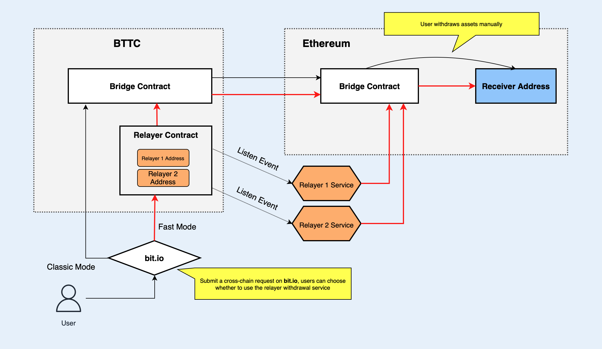

# What is Relayer
Relayer is a kind of automatic cross-chain assets withdrawal service on Bittorrent Chain (BTTC).  After users send an order to transfer assets from BTTC to another block chain, relayer will automatically help users complete the withdrawal operation.

In the case of not using relayer service, users submit a requirement to transfer assets from BTTC to another block chain, and after waiting for about 15-30 minutes,when the assets reach the target chain, the users need to trigger the cross-chain `Bridge Contract` on the target chain to withdraw assets. Because calling the contract needs to pay the gas fee, the users usually need to create an account on the target chain in advance, and ensure that there are enough native tokens in the account of the target chain to pay the gas fee for withdrawing assets from the cross-chain `Bridge Contract`.

In the case of using relayer service on the other hand, when the assets reach the target chain, relayer will help users withdraw the assets from cross-chain `Bridge Contract` to the users' `Receiver Address`, simplifying the users cross-chain operations.

# How Relayer Works
The mechanism of Relayer is shown as follows:



As shown in the figure above, when users submit an asset cross-chain transfer request from BTTC to Ethereum on [bit.io](https://bt.io), they can select Fast mode or Classic mode. If they select Classic mode,meaning not using Relayer service, [bit.io](https://bt.io) will directly call the cross-chain `Bridge Contract` to execute cross-chain operations, after assets reach the cross-chain `Bridge Contract` on Ethereum chain, users need to manually call the cross-chain `Bridge Contract` to withdraw the asset to the `Receiver Address`.

If the users select Fast mode, meaning using Relayer service, the users can select an appropriate Relayer provider according to the fee quotation, then the cross-chain asset will be first transferred to Relayer contract, the Relayer contract will divide the asset, transfer one part of the cross-chain asset to the Relayer provider as service fee, and then call the `Bridge Contract` to transfer the remaining part to `Bridge Contract` for cross-chain operation.

Since the users have appointed the `Receiver Address` when submitting the cross-chain request on BTTC chain, the `Receiver Address` will be included in the cross-chain message to reach Ethereum together, anybody can call the `Bridge Contract` to extract the assets, but assets can only be transferred to the `Receiver Address` in the message. After the Relayer submit the cross-chain request, the service program deployed by Relayer provider will listen to the cross-chain event, when the assets reach Ethereum chain, the Relayer service program will automatically call the cross-chain contract on Ethereum by an external account to withdraw the assets to the `Receiver Address`, and meanwhile pay the gas fee by this external account. 
# Relayer Service Fee
In order to attract more users to try this Relayer service, now the Relayer service only charges 90% of the original cross-chain transfer gas fee, the other 10% is borne by the Relayer service, the Relayer service deducts part of users' cross-chain assets as service fee, the actual deduction amount is calculated as follows:

```
 (cross-chain gas fee / cross-chain token unit price) * 90% 
```

Relayer service will charge the current cross-chain tokens, that is, what kind of cross-chain token is transferred and what kind of token is charged, when calculating the service fee, the gas fee and cross-chain service fee will be converted into the same price unit for calculation.

In the future, [bit.io](https://bt.io) will open the Relayer provider application channel, anyone can apply to become a Relayer provider, the Relayer provider will set the service reasonable fees according to its own operating costs and the consumed gas fee between different block chains. Users will choose a Relayer provider based on factors such as the service fee, service stability and user evaluation etc.

