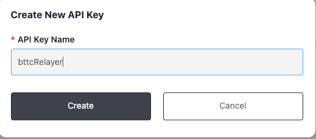
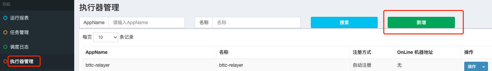
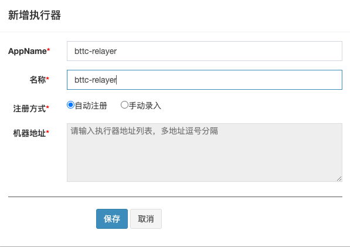
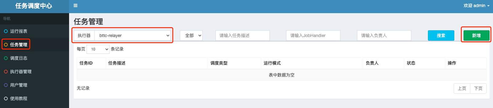
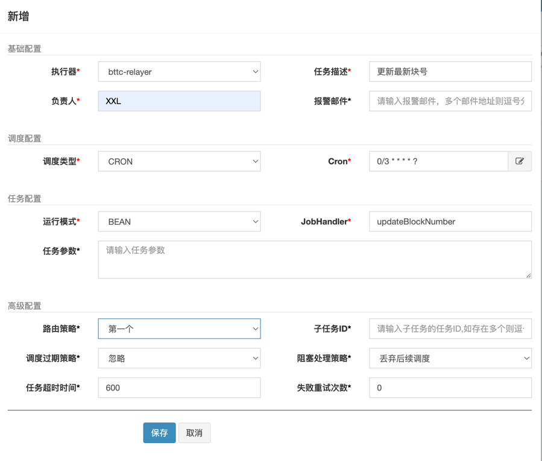
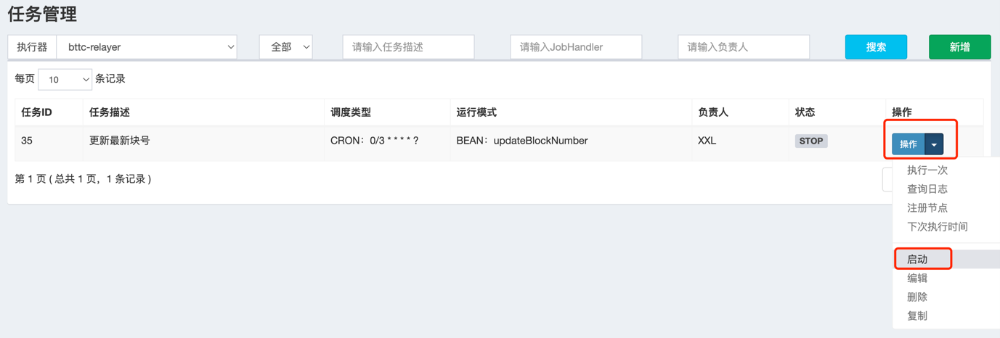
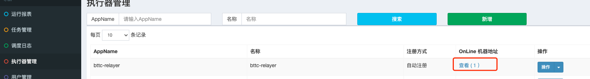

# Deploy Relayer Node


* [Deploy Relayer Node](#deploy-relayer-node)
  * [1 Relayer introduction](#1-relayer-introduction)
  * [2 Required Environment](#2-required-environment)
  * [3 deploy](#3-deploy)
    * [3.1 database](#31-database)
      * [3.1.1 init database](#311-init-database)
      * [3.1.2 intruduction of the tables](#312-intruduction-of-the-tables)
    * [3.2 xxl-job deployment](#32-xxl-job-deployment)
      * [3.2.1 xxl-job service deployment](#321-xxl-job-service-deployment)
      * [3.2.3 add Job](#323-add-job)
      * [3.2.4 start job](#324-start-job)
    * [3.3 deploy relayer node](#33-deploy-relayer-node)
      * [3.3.1 download relayer node code](#331-download-relayer-node-code)
      * [3.3.2 node configuration](#332-node-configuration)
      * [3.3.3 start relayer node](#333-start-relayer-node)
  * [4 The reference criteria for judging whether the service can accept orders normally](#4-the-reference-criteria-for-judging-whether-the-service-can-accept-orders-normally)

## 1 Relayer introduction

`Relayer` is a kind of automatic cross-chain assets withdrawal service on Bittorrent Chain. 
After users send an order to transfer assets from `BTTC` to another block chain, relayer will automatically help users complete the withdrawal operation.

The workflow of `relayer` is as follows:
1. The `relayer` monitors the withdrawal transactions of the `bttc` chain, and filters the transactions that entrusts itself to receiving
2. The `relayer` monitors whether the asset has reached the main chain. If yes ,then goto 3, else , continue to monitor.
3. The `relayer` will help the users receive the asset on the main chain.
4. When the receive transaction confirmed.The `relayer` complets its job.

In the above, the side chain refers to the bttc chain, and the main chain refers to tron, eth, and bsc. This concept applies to the full text.

relayer details refer to [What is Relayer](https://doc.bt.io/docs/bridge/relayer)

## 2 Required Environment

relayer node deployment relies on the following environment:
- relayer server suggestion:
    - CPU: 8 cores
    - Memory: 32G
    - bandwidth: 100M
-  The relayer node relies on the MySQL. Requires version number 8.0 and above
-  The relayer node relies on the xxl-job service, you can refer to the chapter 3.2 "xxl-job deployment" for deployment
-  The relayer node is written in Java and depends on the JRE/JDK environment. Please use JDK8
-  The relayer node needs to synchronize data from bttc, tron, eth, and bsc, so it is necessary to prepare rpc/grpc nodes for each chain
     If the developer has run the above nodes by himself, he can use his own node. If not, the suggestions are as follows:
    - bttc and trongrid: you can use the default node in the relayer program configuration file
    - bsc: you can use the default node in the database, or use the official node, see https://docs.bscscan.com/misc-tools-and-utilities/public-rpc-nodes
    - eth: you can use the default node in the database, but it is recommended to purchase the infura service of Ethereum
-  The relayer service needs to use the http service of trongrid, so you need to apply for the trongrid api key. The application method is as follows:
    - Open https://www.trongrid.io/
    - Register a account and log in
    - Click `Dashboard->Create API Key->enter API name`
      
      
      After completing the above steps, the api key will be automatically generated
    - check API key
      click `"API Keys"->click "check"`,you can see the API Key detail you applied.
      

## 3 deploy

### 3.1 database

#### 3.1.1 init database

The relative path of db scripts is as follows:

sql file for test environment:`/bttc-relayer/doc/db/tables_bttc_relayer_1029.sql`

sql file for online environment:`/bttc-relayer/doc/db/tables_bttc_relayer.sql`

Log in to mysql, here we assume that the username and the password for the MySQL instance deployed locally are `root:root` respectively,
Log in using the following command:
```sh
mysql -u'root' -p'root'
````
create the tables using the following command:
test environment:
```sh
 source #{tables_bttc_relayer_1029 path}/tables_bttc_relayer_1029.sql
```
online environment:
```sh
 source #{tables_bttc_relayer path}/tables_bttc_relayer.sql
```

` tables_ bttc_ Relay path `: the path of sql file

**If the developer wants to use their own eth and bsc node to synchronize the data.
They need to insert the node to the `event_url_config` table as following:**
- First switch to the relayer database
    - the command for test environment
      ```sh
      use bttc_relayer_1029;
      ```
    - the command for online environment
      ```sh
      use bttc_relayer;
      ```
  - the command for test environment

- Then insert the node to the table
    - If the eth node to be added is` https://eth.trongrid.io `, execute the command
      ```sh
      INSERT INTO event_url_config VALUES (1, 'eth', 'https://eth.trongrid.io');
      ```
    - If the bsc node to be added is` https://bsc.trongrid.io `, execute the command
      ```sh
      INSERT INTO event_url_config VALUES (2, 'bsc', 'https://bsc.trongrid.io');
      ```
      
#### 3.1.2 intruduction of the tables

There are 5 tables in the relayer node:
1. transactions:each row data stores a complete withdrawal transaction information,
  including the side chain withdrawal transaction initiated by the user and
  main chain received transaction by the relayer.
2. token_map:the info of tokens that support deposit and withdraw
3. message_center_config:Store the latest block of each chain and the analysis progress of each scheduled task
4. check_point_info:Store the check point information,
  according to which the relayer node program determines Whether the withdrawal asset can be received
5. event_url_config:Store the rpc node of eth and bsc

### 3.2 xxl-job deployment

xxl-job is a distributed task scheduling platform that can easily process the schedule tasks.
The source code has been opened and connected to the online product lines of many companies.

#### 3.2.1 xxl-job service deployment

xxl-job deployment refers the official document:
- document:https://www.xuxueli.com/xxl-job/en/
- github address:https://github.com/xuxueli/xxl-job
- gitee address:http://gitee.com/xuxueli0323/xxl-job

after deploying xxl-job,The url to visit will be generated.
If the xxl-job service is deployed locally and the default service port `8080` is used,

Then the url is http://localhost:8080/xxl-job-admin .
Ensure that the address can be successfully logged in, and then go to the next step.

#### 3.2.2 configure executor

after deploying xxl-job,visit the url and configure executor.
Refer to chapter `4.0 configure executor` of the xxl-job official document for details

1.click left side "Executor Management"->click upper right "add",as follows:



2.add executor,for example as follows:



AppName:the unique identity of the executor cluster,executor will register automatically and periodically by appname so that it can be scheduled.
And this para will write to the configurations file of relayer node

#### 3.2.3 add Job

Refer to chapter `2.5 Start first job “Hello World”` of the xxl-job official document for details.

1.Click Task Management ->select the actuator added in 3.2.2 at the top left of the page ->click Add at the top right, as follows:
   
   

2.Add a total of 12 jobs according to the following information, corresponding to 12 scheduled tasks of the relayer node.

- `高级配置` can be uniformly configured as follows:
    - `路由策略`:`第一个`
    - `阻塞处理策略`:`丢弃后续调度`
    - `任务超时时间`:600
    - `失败重试次数`:0
- `调度类型`: CRON
- Other key configurations are different for each task. See the following table for details:

|任务描述 | Cron | JobHandler | 
| :------:| :------: | :------: |
| updateBlockNumber  | 0/3 * * * * ? | updateBlockNumber |
| bttcWithdraw synchronization| 0/6 * * * * ? | bttcWithdraw |
| bttcWithdraw synchronization-enhance | 0 0/1 * * * ?| bttcWithdrawAdd|
| checkpoint synchronization-unconfirm| 0 0/1 * * * ?| mainChainCheckpointUnConfirm|
| checkpoint synchronization-confirm| 0 0/1 * * * ?| mainChainCheckpointConfirmed|
| update transactions status by checkpoint| 0/15 * * * * ?| updateTransactionsByMessage|
| update transactions status by checkpoint-Enhance| 0 0/1 * * * ?| mainChainCheckpointEnhance|
| submit mainchain withdraw（normal）| 0 0/1 * * * ?| mainchainSubmitWithdraw|
| submit mainchain withdraw（for failed transactions）| 0 0/5 * * * ?| mainchainSubmitWithdrawFailed|
| update transactions status|0/10 * * * * ? | updateTransactionStatus|
| mainChainWithdraw|0/6 * * * * ? |mainChainWithdraw |
| mainChainWithdraw-enhance| 0 0/1 * * * ?|mainChainWithdrawAdd |

3.example

Take `updateBlockNumber` job as example:



#### 3.2.4 start job

After the above work is completed, please deploy the relayer node in section 3.3 first. 
After completing the deployment and starting the relayer node, and the relayer node is successfully registered on the XXL-JOB service, start the job as follows:

click `操作` -> `启动`, as follows:



You can view the scheduled task execution results through the scheduling log. 
If all tasks succeed at least once, the startup is successful. 
(There will be several failures at the beginning, which is normal)

The way to confirm that the node is successfully registered on the XXL-JOB service is as follows:

You can confirm whether the relayer node is successfully registered on the XXL-JOB service through the following figure.



If the relayer node server information does not appear, 
you can view the reason for the registration failure through the xxl-job service log.
Maybe you can try to change the executor registration method to manual entry, 
and add the relayer node server `ip: callback port` as shown below:


### 3.3 deploy relayer node

#### 3.3.1 download relayer node code

the node code is lacated on https://github.com/bttcprotocol/bttc-relayer
Developers can download from github as follows:
```sh
git clone git@github.com:bttcprotocol/bttc-relayer.git
```
#### 3.3.2 node configuration

Relayer node configuration files are located in the /src/main/resources directory

application-pretest is the configuration file of the bttc test network, 
and application-prod is the configuration file of the bttc main network.

In the configuration file, the contract and some url configurations cannot be changed, 
and other content needs to be configured by the developer. The content involved is as follows:

1.database info

```sh
spring:
    datasource:
        url: database url
        username: database username
        password: database password
```
note: create database refers to chapter 3.1

2.Http service port of relayer node

The relayer node provides a http interface to query whether the relayer node service is online.

If the relayer node ip is 10.10.10.10 and the http service port is set to 8081,
The url of the http interface is` http://10.10.10.10:8081/status/info ` .
When applying for relayer and filling in relayer information, this url needs to be filled in the `Relay service address`.

Please ensure that the url is available. 
When applying for relayer, if the url is not available, the application will fail; 
After officially becoming a relayer, if the url is not available, it will lead to failure to receive orders normally
```sh
server:
    port: the http service port of relayerer node
```
3.api key of trongrid http service

the application method refers to the fifth iterm of chapter 2 "Required Environment"
```sh
client:
    tron:
        api:
            name: trongrid api key name
                key: trongrid api key
```
Note: The application methods for the trongrid test environment and the online environment are the same. 
To ensure that the qps of the online environment not affected. 
you should use different api keys for the online environment and the test environment;

4.xxl-job configuration
the deployment for xxl-job refers to chapter 3.2 "xxl-job deployment"
 ```sh
xxl:
    job:
        admin:
            addresses: xxl-job url (for example: http://localhost:8080/xxl-job-admin)
        executor:
            appname: executor AppName (for exmaple "bttc-relayer")
            port: the callback port for xxl-job (for example "9999")
```
note:Please make sure that the server running relayer node and the server running xxl-job can access related nodes each other.
Taking the above configuration as an example, the server running the relayer node can access port 8080 of the xxl-job server, and the xxl-job server can access port 9999 of the relayer node server

5.slack configuration
 ```sh
client:
    slack:
        url: The slack url that is used to receive error messages encountered during relayer execution. If the developer does not use slack, the configuration can be ignored, but the alarm message cannot be received
```
6.the start block for the scheduled tasks

When the withdrawal and checkpoint schedule tasks are executed for the first time, 
they need to set a start block, specifying which block the task starts to parse from,
In the future, they will read the parsing progress from message_center_config table.

Since the developer has not yet become a formal relayer 
and has not received the order when they deployment the relayer node, 
so there is no need to care about historical data.

It is recommended to set the initial parsing block of each chain to the latest block minus 1000
```sh
parseData:
    tronInitBlockNumber: start bock numer of tron
    ethInitBlockNumber: start bock numer of eth
    bscInitBlockNumber: start bock numer of bsc
    bttcInitBlockNumber: start bock numer of bttc
```
Note: If the configured starting block is too far away from the latest block, 
it will take a long time to synchronize to the latest block,
and you need to synchronize to the latest block before you can start receiving orders.
Otherwise, it may result in that the transactions designated to be received cannot be parsed within the specified time, 
and the user cannot be assisted in receiving them, thus being punished.

7. Transaction timeout

Transaction timeout contains 2 cases:

-timeout of transactions success: means that the main chain receiving transaction unsuccessfully within the specified time;

-timeout of transactions confirm: means that the block that contains the main chain receiving transaction forks.

For the above two cases, the transaction will be restarted in the scheduled task mainchainSubmitWithdrawFailed.
```sh
parseData:
  parseTimeout: timeout of Transaction succcess (in minutes)
  confirmTimeout: timeout of Transaction confirm (in minutes)
```
Note: the timeout period should not be set too long, 
which may result in exceeding the specified assistance receiving time

8. relayer info
```sh
relayer:
    address:
        bttc: relayer account address on bttc
    defaultGasPrice:
        eth: the default gas price when submit eth transactions
        bsc: the default gas price when submit bsc transactions
    defaultGasPriceLimit:
        eth: the gas price limit when submit eth transactions. If exceed this value, the relayer node will not submit the transactions
        bsc: the gas price limit when submit bsc transactions. If exceed this value, the relayer node will not submit the transactions
    key: The private key corresponding to the the main chain account address of relayer. At present, the program is configured with three main chain addresses corresponding to the same key. If the relayer has different keys for 3 main chains, the developer needs to change the program themself
```
::: tip
For the key security reasons, it is recommended to set the configuration file permission to 600 in the production environment, that is, only the owner can read and write.
:::

#### 3.3.3 start relayer node

Note: This program can only be started after the database preparation and xxl-job deployment (i.e., 3.1 and 3.2) are completed.
In the bttc-relayer directory, execute the following command to start

```sh
#compile
./gradlew build -x test

##go lib directory
cd build/libs

##create logs directory
mkdir logs

#deploy
nohup java -Xms16g -Xmx16g -XX:+UseG1GC -XX:+PrintGCDetails -Xloggc:./logs/gc.log -XX:+PrintGCDateStamps -XX:+HeapDumpOnOutOfMemoryError -Ddruid.mysql.usePingMethod=false -Dspring.profiles.active=$profile -jar bttc-relayer-1.0-SNAPSHOT.jar >/dev/null 2>&1 &
```
$profile: refers to the configuration file used, such as the test environment, the command is,
nohup java -Xms16g -Xmx16g -XX:+UseG1GC -XX:+PrintGCDetails -Xloggc:./logs/gc.log -XX:+PrintGCDateStamps -XX:+HeapDumpOnOutOfMemoryError -Ddruid.mysql.usePingMethod=false -Dspring.profiles.active=pretest -jar bttc-relayer-1.0-SNAPSHOT.jar >/dev/null 2>&1 &

view logs using the following command:

view info log:
```sh
tail -f logs/info.log
```
view warn log:
```sh
tail -f logs/warn.log
```
view error log:
```sh
tail -f logs/error.log
```
## 4 The reference criteria for judging whether the service can accept orders normally

After all the above service is built and started normally.
if the following two conditions are met, it means that the service can accept orders normally.

1. The xxl-job task scheduling is normal, which can be confirmed by viewing the scheduling log.
   (It can be ignored if task execution fails due to "block strategy effect: Discard Later" occasionally. )

2. The progress of each scheduled task recorded in the message_center_config table is normal:

If the following standards are not met, you need to wait for the relayer node service to continue running until the standard in the table is reached 
(if the block number in the table below does not change for a long time, you need to check the `error.log` to see the reason).

- The main chain contains the progress records of the following scheduled task parsing blocks:

| contract_address | Task meaning | the reference standard of Task synchronization normal |
| :------:| :------: | :------: |
| BlockNumber | The latest solidified/non-solidified block number of the main chain | The time difference between this block number and the latest block number on the chain is within 2 minutes |
| MainChainCheckpoint | Synchronized block number of MainChainCheckpoint parsing task | > BlockNumber - 500 |
| MainChainWithdraw-chaintoken | Synchronized block number of MainChainWithdraw-chaintoken parsing task | > BlockNumber - 500|
| MainChainWithdraw-erc| Synchronized block number of MainChainWithdraw-erc parsing task| > BlockNumber - 500|
| MainChainCheckpoint-enhance| Synchronized block number of MainChainCheckpoint-enhance parsing task| The value is greater than or equal to the block number of the latest checkpoint on the main chain|
| MainChainWithdraw-chaintoken-Add| Synchronized block number of MainChainWithdraw-chaintoken-Add parsing task | For tron and bsc chains: > BlockNumber - 1100; for eth: > BlockNumber - 630 |
| MainChainWithdraw-erc-Add| Synchronized block number of MainChainWithdraw-erc-Add parsing task| For tron and bsc chains: > BlockNumber - 1100; for eth: > BlockNumber - 630|

- side chain contains the progress records of the following scheduled task parsing blocks:

| contract_address |             Task meaning |        the reference standard of Task synchronization normal        |
|:-----------------:|:-----------------:|:----------------------:|
| BlockNumber      | The latest solidified/non-solidified block number of the main chain | he time difference between this block number and the latest block number on the chain is within 2 minutes |
| BttcWithdraw     |    Synchronized block number of BttcWithdraw parsing task | 与BlockNumber值相差500块以内  |
| BttcWithdrawAdd  |  Synchronized block number of BttcWithdraw parsing task | 与BlockNumber值相差800块以内  |

note:
`max_unconfirm_block`column: the confirmed block number resolved for the task;
`max_unconfirm_block` column: the unconfirmed block number resolved for the task,
only `BlockNumber` and `MainChainCheckpoint` two scheduled tasks will parse unconfirmed blocks,
Therefore, for the `max_unconfirm_block` column, only the data  of `contract_address` is `BlockNumber` and `MainChainCheckpoint` is not 0.

only `BlockNumber` and `MainChainCheckpoint` two scheduled tasks will parse non-fixed blocks,
Therefore, for the `max_unconfirm_block` column, only the  value of `BlockNumber` and `MainChainCheckpoint` is not 0.

       
        
   


