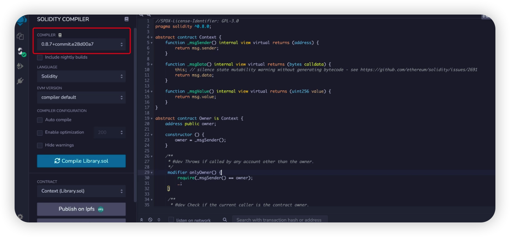

import useBaseUrl from '@docusaurus/useBaseUrl'

# Build a Web3 App On BTTC
This article is a zero-to-one DApp development tutorial, beginning with the deployment of the simplest Hello World contract, progressing through writing the contract and UI interaction to the complete deployment and online process, and culminating with learning to build a decentralized library to learn how to deploy their own DApp on the BTTC blockchain.
## Prerequisites

### Nodej v10+

```sh
node -v
v10.24.1
```

### Metamask

Install [MetaMask](https://chrome.google.com/webstore/detail/metamask/nkbihfbeogaeaoehlefnkodbefgpgknn) Chrome extension.

## What Are We Doing

We are building a decentralized library that contains the following functions:

* Book borrowing
* Book browsing
* Book adding

Download the complete project code from [here](https://github.com/TRON-Developer-Hub/decentralized-library), and run npm install to install dependencies.

## Data Structure
Typically, borrowers are concerned with the title, content, availability, and price of the book. On this basis, we design a structure in the contract called Book, which comprises the following properties:

```js
struct Book {
       string name;
       string description;
       bool valid; // false if been borrowed
       uint256 price; // BTT per day
       address owner; // owner of the book
   }
```

We hope that the library will be able to have an easy way to find every book. To do this, we build a bookId attribute and a mapping relationship between bookId and Book, named books.

```js
uint256 public bookId;

mapping (uint256 => Book) public books;
```
Additionally, we must keep track of each book's rental information, including the borrower and the start and end dates.

As with Book, construct a structure called Tracking to keep track of this data. This structure possesses the following fields:
```js
struct Tracking {
       uint256 bookId;
       uint256 startTime; // start time, in timestamp
       uint256 endTime; // end time, in timestamp
       address borrower; // borrower's address
   }
```
Similarly, a mapping relationship must be established to manage each rental record:
```js
uint256 public trackingId;

mapping(uint256 => Tracking) public trackings;
```
## Functions and Events
We are adding fundamental functions to our library, including:
* Add a book to the library - addBook
* Borrow a book - borrowBook
* Remove a book from the library - deleteBook
### addBook
```js
/**
    * @dev Add a Book with predefined `name`, `description` and `price`
    * to the library.
    *
    * Returns a boolean value indicating whether the operation succeeded.
    *
    * Emits a {NewBook} event.
    */
   function addBook(string memory name, string memory description, uint256 price) public returns (bool) {
       Book memory book = Book(name, description, true, price, _msgSender());

       books[bookId] = book;

       emit NewBook(bookId++);

       return true;
   }

   /**
    * @dev Emitted when a new book is added to the library.
    * Note bookId starts from 0.
    */
   event NewBook(uint256 bookId);
```

### borrowBook

```js
   /**
    * @dev Borrow a book has `_bookId`. The rental period starts from
    * `startTime` ends with `endTime`.
    *
    * Returns a boolean value indicating whether the operation succeeded.
    *
    * Emits a `NewRental` event.
    */
   function borrowBook(uint256 _bookId, uint256 startTime, uint256 endTime) public payable returns(bool) {
       Book storage book = books[_bookId];

       require(book.valid == true, "The book is currently on loan");

       require(_msgValue() == book.price * _days(startTime, endTime), "Incorrect fund sent.");

       _sendBTT(book.owner, _msgValue());

       _createTracking(_bookId, startTime, endTime);

       emit NewRental(_bookId, trackingId++);
   }
```

### deleteBook

```js
/**
    * @dev Delete a book from the library. Only the book's owner or the
    * library's owner is authorised for this operation.
    *
    * Returns a boolean value indicating whether the operation succeeded.
    *
    * Emits a `DeleteBook` event.
    */
   function deleteBook(uint256 _bookId) public returns(bool) {
       require(_msgSender() == books[_bookId].owner || isOwner(),
               "You are not authorised to delete this book.");
      
       delete books[_bookId];

       emit DeleteBook(_bookId);

       return true;
   }
```
We use two tool methods in the borrowBook method: `_sendBTT` and `_createTracking`. We do not wish for users to invoke these APIs. As a result, in accordance with Solidity's standards, we identify them as internal, which means they can be accessed only within the contract.

### _sendBTT
```js
/**
    * @dev Send BTT to the book's owner.
    */
   function _sendBTT(address receiver, uint256 value) internal {
       payable(address(uint160(receiver))).transfer(value);
   }
```

### _createTracking

```js
/**
    * @dev Create a new rental tracking.
    */
   function _createTracking(uint256 _bookId, uint256 startTime, uint256 endTime) internal {
         trackings[trackingId] = Tracking(_bookId, startTime, endTime, _msgSender());

         Book storage book = books[_bookId];

         book.valid = false;
   }
```

The contract is done, it’s time to deploy it.

## Deployment and Testing
We compile and deploy contracts using [Remix](https://remix.ethereum.org/). Deploying the contract requires burning BTT to pay for gas, and BTT test coins can be obtained here.

Open Metamask and select Custom RPC from the networks dropdown


Fill in the information as per the chart：

* Network Name: BitTorrent Chain Donau
* RPC URL: https://pre-rpc.bt.io/ 
* ChainID: 1029
* Symbol: BTT
* Block Explorer URL: https://testscan.bt.io/


First, in the DEPLOY & RUN TRANSACTIONS section of Remix, select Injected Web3 from the Environment drop-down menu.


Select a compiler version 0.8.0 and higher


After clicking Deploy, MetaMask will bring up the transaction confirmation window


Congratulations, the Library contract has been successfully deployed to the BTTC test network and you can now interact with it and check its status in your browser!
## Build the DApp
To begin, copy the contract address that was previously deployed into the libraryContractAddress variable in utils.js.
### Link the UI to Metamask
The following step is to link the UI to the Metamask Chrome wallet. Metamskinjects the web3 object into each browser page, allowing the DApp to communicate with the BTTC network.

Create the following code in dapp-ui/plugins/utils.js to retrieve the smart contract object and save it to the global variable. Then you can directly interact with the contract via the global variable.

```js
export async function setLibraryContract() {
     var MyContract = web3.eth.contract(LibraryABI); 
     bookRentContract = await MyContract.at('0xe7BBc13a279f11D313B2c8304CdcDfC856C7603C');
}
```

### Functions
After connecting our user interface to Metamsk, we need to analyze how the user interface interacts with smart contracts. As a result, a contract object must be created to represent the decentralized library smart contract.

The library should have three fundamental functions：

* Add a book
* Browse available books
* Borrow a book

In index.vue, call `setLibraryContract()` to initialize the contract object.

```js
 async mounted() {
   // init contract object
   await setLibraryContract();
   // fetch all books
   const books = await fetchAllBooks();
   this.posts = books;
 },
```
#### Add a Book
To begin, construct an add book form for users to submit information about book rentals. On the back end, it will communicate with the library contract's addBook function.

Add the following code to dapp-ui/components/postAd() bookForm.vue's function:

```js
 postAd() {
     postBookInfo(this.title,this.description,this.price);
 }
```

Add the following code to `postBookInfo()` of dapp-ui/plugins/utils.js:

```js
const result = await bookRentContract.methods.addBook(name,description,price).send();
```

#### Browse All Available Books

The `fetchAllBooks()` function returns the book list, which contains a list of all available books.

Add the following code to dapp-ui/plugins/fetchAllBooks() utils.js's function:

```js
 const books = [];

 const bookId  = await bookRentContract.methods.bookId().call();
 //iterate from 0 till bookId
 for (let i = 0; i < bookId; i++){
   const book = await bookRentContract.methods.books(i).call()
   if(book.name!="") // filter the deleted books
   {
     books.push(
       {id: i,name: book.name,description: book.description,price: book.price}
     )
   } 
 }
return books
```

In index.vue, call `fetchAllBooks()` to retrieve book information and show it on the homepage.

#### Borrow a Book

The user may borrow the book after viewing the book's information.

In the `book()` function of dapp-ui/components/detailsModal.vue, add the following code:

```js
     // get Start date
     const startDay = this.getDayOfYear(this.startDate)
     // get End date
     const endDay = this.getDayOfYear(this.endDate)
     // price calculation
     const totalPrice =this.propData.price * (endDay - startDay)
     // call metamask.bookProperty
     borrowBook(this.propData.id, startDay, endDay, totalPrice)
```

dapp-ui/plugins/utils.js, add the following code to the `borrowBook()` function:

```js
 const result = await bookRentContract.methods.borrowBook(spaceId,checkInDate,checkOutDate).send();
```

The development of the library Dapp is done.

## Run the DApp
Ascertain that Metamask is logged in before running the following command to start the service:

```sh
npm run dev
```
To view the front-end page, type localhost:3000 into the browser's address bar.


To post book rental information, click the "Rent Your Books" button in the upper right corner. The title of the book, a brief description of the book, and the cost of the book for one day are all included in the material.

After you've completed the form, click the "Submit" button. The information will be passed to the library contract's addBook function, which will generate a transaction that triggers the contract. Then, as illustrated below, a Metamask pop-up box will open, requesting confirmation and signature:


After successfully connecting the transaction to the chain, the following leasing information will be displayed on the page:


Click "View" to view the book's comprehensive details and to select the rental period. To initiate a lease request, click "Lent Now", then the library contract's borrowBook function will be called. Additionally, the leasing transaction must be signed and broadcasted to finish it.


