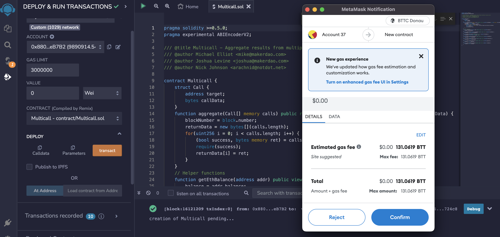
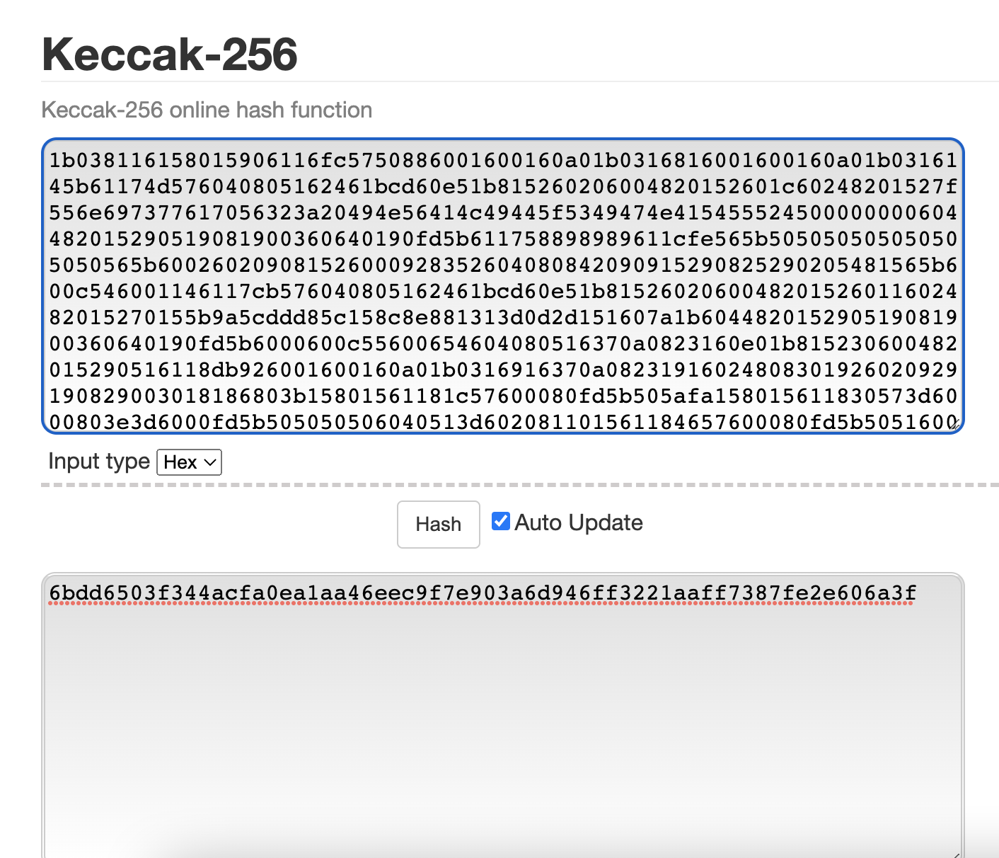
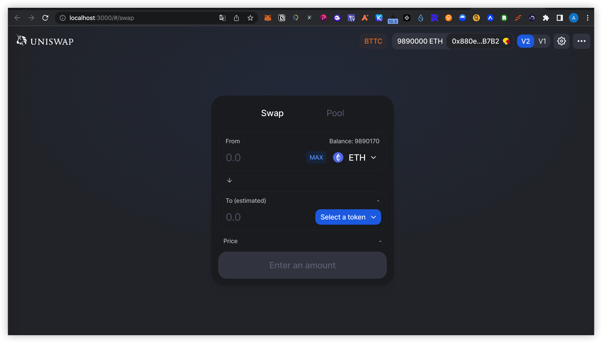

# Quick Migration Guide for Ethereum DApp

In order to help developers migrating Ethereum DApp to BTTC network in an easier way, we will take *Uniswap* as an example, introduce how to migrate both DApp contracts and the frontend UI using the Ethereum IDE - Remix.

## Differences between BTTC and Ethereum

The basic layer of BTTC network is compatible with EVM, which reduces the workload of migration for DApp developers, the whole process will be smooth as well. However, there are some differences we need to pay attention to:
* Token unit：BTTC uses BTT to replace wei and ether in Ethereum
* Account address format: BTTC uses the same format as Ethereum's
* For RPC please refer to this documentation: [network][BTTC network]

## The overall guideline for the migration

Please refer to the following steps to migrate the DApp:

1. Evaluate the primary function of the DApp, order them with the dependencies between each function.For Uniswap, the dependencies will be:
    * Add [BTTC network config][BTTC network] in MetaMask
    * Connect with MetaMask wallet
    * Show tokens and balance on the swap UI
    * Create trading pairs and add liquidity
    * Ability to swap
    * Ability to remove liquidity

   To add BTTC Donau testnet in MetaMask:
    * Network Name:BTTC Donau Testnet
    * RPC URL: https://pre-rpc.bt.io/
    * ChainID:1029
    * Symbol(optional):BTT
    * Block Explorer: https://testscan.bt.io

2. Migrate DApp contracts based on chapter [Uniswap contract migration](#Uniswap-contract-migration), deploy to the BTTC testnet.
3. According to the functional dependencies from step 1 and the section about [Modify Uniswap frontend code](#Modify-Uniswap-frontend-code), debug each function one by one.


## Uniswap Migration

In order to better help developers migrate the Ethereum DAPP to BTTC network, we will use Uniswap as an example and show you the migration process along with the conversion points. Uniswap has elaborated business process and certain complexity compared with other DApps, therefore, Uniswap will be a good representative for DApp migration.

### Uniswap business process

* Connect MetaMask wallet, select an account and link, then the Uniswap frontend will display the account linked and the native token balance.
* On the swap page, click and select tokens to check the balance of different tokens.
* On the pool UI, you can create trading pairs and add liquidity, you might need to wake up the MetaMask wallet, grant consent and sign. The newly created trading pair and liquidity will be displayed on the page after authorization. Click the *remove* button can remove liquidity by specified percentage.
* Switch back to swap UI to swap the tokens with the trading pairs you just created, will require MetaMask signature.

### Uniswap contract migration

Uniswap contracts code please refer to [swap-contracts](https://github.com/treelaketreelake/swap-contracts). Below is the deployment in details.

#### Prerequisites
1. Install MetaMask wallet and add BTTC network, please refer to this doc's [wallet](https://doc.bt.io/docs/wallet#metamask) chapter.
2. We will use **BTTC Donau testnet**, test token can be obtained from the [faucet](https://testfaucet.bt.io/#/).

#### Use online IDE Remix

Use [RemixIDE](https://remix.ethereum.org/) to deploy contract please see [Deploy contract with Remix](https://doc.bt.io/docs/smartcontract/deploy-contracts) doc. Among others，please mainly deploy these Uniswap trading pair contracts listed as follows:
* uniswapV2Factory
* WETH
* Multicall
* uniswapV2Router02
* ERC20A，ERC20B（test token）

Compile related contracts:

* Compile uniswapV2Factory contract
* Compile WETH contract
* Compile uniswapV2Router02 contract
* Compile ERC20A/ERC20B contract

Deploy aforementioned contracts to BTTC Donau testnet. In RemixIDE's ENVIRONMENT,select *Injected Provider - MetaMask*:

* Deploy uniswapV2Factory contract，the feeToSettter value is the contract deployer.


* Deploy WETH contract


* Deploy Muticall contract


* Deploy uniswapV2Router02 contract
**First get initCode**: Compile UniswapV2Pair contract, get pair bytecode，then get the object field content，open [keccak 256 tool](http://emn178.github.io/online-tools/keccak_256.html)，paste the object field, select input type HEX, then got the initCode as the following picture.

Replace uniswapV2Router02 contract's initCode

Lastly, deploy uniswapV2Router02 contract


* Deploy ERC20A/ERC20B contract


* Recode the contract address after the deployment
    ```javascript
    uniswapV2Factory at: 0x156a06c0e2e248f1904d0c089ad7b8f557f5bd1f
    WETH at: 0x2e1a6ed102fa50a6c9027c9c031245ec157010ed
    uniswapV2Router02 at: 0x49d769b538921525d74ed87445c9a079f82548ee
    Multicall at:0x59bc158d32033138e454604c03d4c9b1a1befa44
    initHash at: 0x1a6d2ed3e4401e99398dc98ed6292bad49c7e0760d0026a54c1c7597c227373b
    ERC20A at:0xf426e0995542bf01a07b97d9f8dcd684ccce005e
    ERC20B at: 0x734f54b414d63b788aff5aef1dbc9616cf8d8a9a
    ```

### Modify Uniswap dependency library

Package name: uniswap-sdk
Source code in GitHub: [Uniswap](https://github.com/Uniswap/v2-sdk/tree/a88048e9c4198a5bdaea00883ca00c8c8e582605)
#### Modify location: src/constants.ts 
First replace the *FACTORY_ADDRESS* and *INIT_CODE_HASH* to the new data, then add BTTC Donau testnet in chainID enum.
```javascript
export const FACTORY_ADDRESS='0x156a06c0e2e248f1904d0c089ad7b8f557f5bd1f'
export const INIT_CODE_HASH='0x1a6d2ed3e4401e99398dc98ed6292bad49c7e0760d0026a54c1c7597c227373b'

export enum ChainId {
  MAINNET = 1,
  ROPSTEN = 3,
  RINKEBY = 4,
  GÖRLI = 5,
  KOVAN = 42,
  BTTC =1029
}
```


#### Modify src/entities/token.ts
Change below address to the newly generated WETH token address (WETH at). After the alternation compile and get the new *dist* directory, replace the old one.

```javascript
export const WETH = {
[ChainId.BTTC]: new Token(
  ChainId.BTTC,
  '0x2e1a6ed102fa50a6c9027c9c031245ec157010ed',
  18,
  'WETH',
  'Wrapped ETH'
),,
```


### Modify Uniswap frontend code

⚠️ Note: Currently Uniswap has many frontend versions, there are differences between each version, we will use [uniswap-interface-2.6.0](https://github.com/Uniswap/interface/tree/v2.6.0) in this guide.

#### Modifiy src/connectors/index.ts
Add BTTC Donau testnet chainID in supportedChainIds.
```javascript
export const injected = new InjectedConnector({
supportedChainIds: [1, 3, 4, 5, 42,1029]
})
```


#### Modify src/constants/index.ts
Replace ROUTER_ADDRESS to the newly generated router contract address.
```javascript
export const ROUTER_ADDRESS = '0x49d769b538921525d74ed87445c9a079f82548ee'
```


#### Modify src/constants/multicall/index.ts
Add BTTC Donau testnet and it's multicall contract address in MULTICALL_NETWORKS.

```javascript
[ChainId.BTTC]:'0x59bc158d32033138e454604c03d4c9b1a1befa44'
```


#### Modify src/constants/list.ts

```javascript
exportconstDEFAULT_TOKEN_LIST_URL='http://yourIP/token-list.json'
```

#### Test
Run `yarn start`, start the testing process.




### Summary of Uniswap migration

* Add BTTC Donau testnet network configuration in swap source code and denpendency library @uniswap/sdk, let the app support the BTTC testnet with chainID `1029`.
* Modify business related dependency contract `UniswapV2Library`'s `init code hash` then deploy the corresponding contract of business logic (uniswapV2Factory/WETH/uniswapV2Router/multicall), obtain the contract address.
* Replace the contract address in swap source code (uniswapV2Factory/WETH/uniswapV2Router/multicall/initHash)
* And in @uniswap/sdk (uniswapV2Factory/WETH/uniswapV2Router/multicall/initHash)。

## Summary of DAPP Migration

We use Uniswap's migration as an example, the main ajustments are required by the business logic. Such as supporting new network or change to the new contract address. Therefore, before the final migration, it is vital to sort out the business logic, what's following will be smooth.

[BTTC network]: https://doc.bt.io/docs/networks/network
