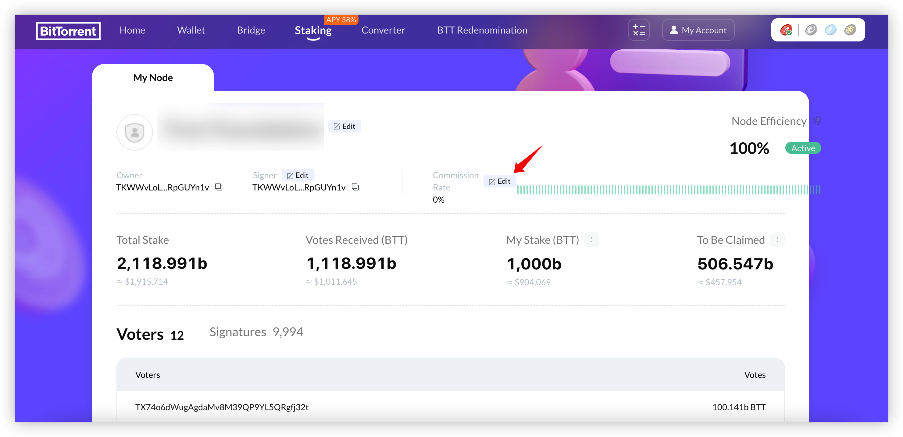
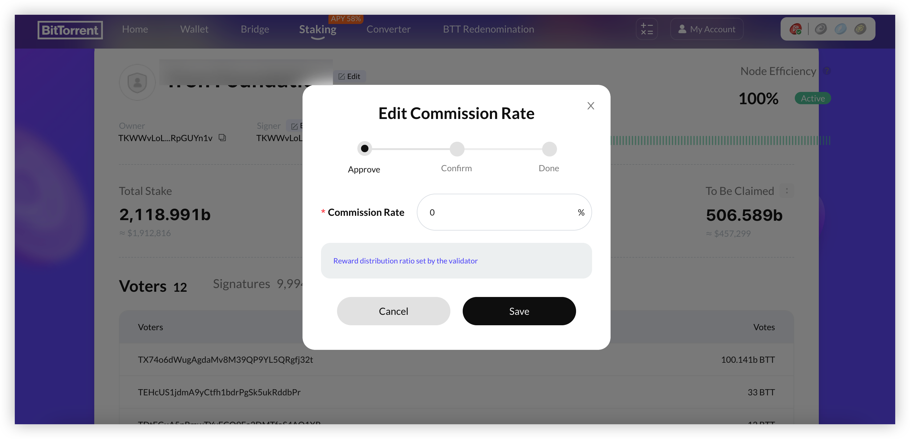

# Commission Operations

You can set up and change your [commission](/docs/validator/glossary#commission) as a validator.

A validator is entitled to charge any commission rate. The minimum commission would be 0% and the maximum commission would be 100% of the rewards earned.

You are allowed to change the commission rates as many times as you would like.

As a validator, it is one of your responsibilities to inform the community on commission changes. See [Validator Responsibilities](/docs/validator/responsibilities).

## Change your commission rate

You can change your commission rate.

1. With your owner address, login to the [staking dashboard](https://bt.io/staking/myAccount).
1. On the `My Node` page in `My Account`，click the **Edit** button to the right of the commission rate

3. Enter your new commission rate，click **Save** button

Once you have confirmed and signed the transaction your commission rate will be set.

Once the commission is updated, there is a cool down period of 80 checkpoints.
