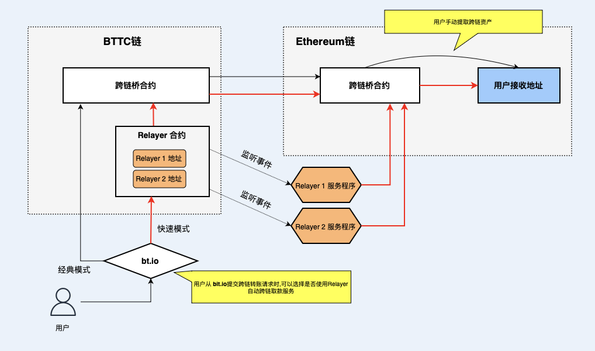

# 什么是 Relayer
Relayer 是 BTTC 上资产跨链后的自动提款服务，用户将资产从 BTTC 上转移到其他链后，Relayer 会在接收链上帮助用户自动完成提款操作。

在没有使用 Relayer 服务的情况下，用户提交资产从 BTTC 链转移到其他链的请求，等待 15～30 分钟后资产达到目标链，需要用户在目标链调用`跨链桥合约`来提取资产。由于调用合约需要支付 Gas 费用，所以通常用户需要提前在目标链上创建了账户并确保账户中有足够的原生链代币来支付 Gas 费用。

使用 Relayer 服务后，当资产达到目标链后， Relayer 会帮助用户将跨链资产从`跨链桥合约`提取到`用户接收地址`，简化了用户的跨链操作。
## Relayer 的原理
下图是 Relayer 工作机制：




如上图所示，用户在 [bt.io](https://bt.io) 上提交 BTTC 到 Ethereum 的资产跨链请求时， 可以选择 Fast 模式或 Classic 模式，如果选择 Classic 模式，即不使用 Relayer 服务，[bt.io](https://bt.io) 会直接调用`跨链桥合约`执行跨链操作，当资产达到Ethereum链的`跨链桥合约`时，需要用户手动调用`跨链桥合约`将资产提到`用户接收地址`中。

如果用户选择了 Fast 模式，即使用 Relayer 服务，用户可以根据 Relayer 服务商的费用报价选择一个合适的服务商，用户跨链资产首先被转移给 Relayer 合约，Relayer 合约对资产进行切分，从跨链资产转移一部分给 Relayer 服务商作为费用报酬，然后将剩余部分提交给`跨链桥合约`进行跨链操作。


由于用户在 BTTC 链上提交跨链请求时指定了`用户接收地址`，该`用户接收地址`会被包含在跨链消息中一起到达 Ethereum 链，任何人都可以调用`跨链桥合约`触发提取资产行为，但是资产只会被提取到跨链消息中指定的`用户接收地址`。当 Relayer 合约提交跨链请求后，Relayer 服务商部署的服务程序会监听到跨链事件，当资产到达 Ethereum 链后，Relayer 服务程序会自动通过它的一个外部地址调用 Ethereum 链上的跨链合约将资产提取到接收者地址，并通过该外部地址支付 Gas 费用。

用户在选择快速模式时，可以选择将少量转出资产转换成相应的目标链汽油费，以满足用户在目标链接收跨链资产后需要支付汽油费转账的场景。Relayer 将承担因汇率波动造成的额外费用。

## 申请成为Relayer

[bt.io](https://bt.io) 已开启 Relayer 申请通道， 任何人都可以申请成为 Relayer，通过协助用户跨链并赚取手续费收益。Relayer 可以根据自己的运营成本和不同目标链的提款 Gas 消耗来设定费用。用户会根据费用、服务稳定性、用户评价等因素来选择 Relayer。

在申请成为 Relayer之前， 首先准备一台空闲服务器部署好Relayer 服务程序，请参考：[部署 Relayer 服务](https://doc.bt.io/zh-Hans/docs/bridge/relayer/relayerdeploy)

然后需要在 BTTC 主网准备最少 250 亿 BTT 的保证金，保证金在 Relayer 工作期间需要一直保持抵押状态，申请 Relayer并质押保证金的请参考:[申请 Relayer](https://bt.io/relayer-apply)。

如果 Relayer 不再参与 BTTC 网络，则可以随时申请退出，退出成功后可取回保证金，请参考[ Relayer 退出并取回保证金](https://doc.bt.io/zh-Hans/docs/bridge/relayer/relayerwithdraw)。

### Relayer奖励

用户使用Relayer服务时支付的手续费会全部作为奖励实时结算并由合约发给Relayer账户。

Relayer 可以自主设置服务费用， 建议费用设置为提款交易 Gas 费的120%，计算公式如下：

```
（跨链消耗的 Gas 费用 / 跨链代币的单价）* 120%
```

Relayer 从当前跨链的代币中扣除部分作为手续费，即跨什么币，收什么币, 计算费用时会将上述 Gas 费用和跨链代币转化成同一个记价单位进行计算。

### 预留手续费

在 Relayer 申请被审批通过后，就可以开始接单。而在接单过程中，Relayer 需要调用智能合约以协助完成跨链用户的资产接收。由于调用智能合约需要消耗一定数量的 gas，因此建议 Relayer 在接单前准备足够的 gas 以应对这种消耗，建议预留的手续费：


| 网络 | 建议预留的交易费 | 
| -------- | -------- |
| TRON   |   50,000 TRX 或同等资源(能量&带宽)   |
| Ethereum   | 5 ETH  |
| BSC  |1 BNB  |


如果因 gas 费不足等原因导致订单未能完成，Relayer 将会被扣除一定数量的保证金，同时还会导致成单率降低。系统不会推荐成单率低于 60% 的 Relayer 给用户。

### 惩罚机制
如果 Relayer 无法在规定的时间内完成订单，则需要被扣除一定的保证金作为惩罚，惩罚量计算方法是首先获取 Relayer 收费金额和协助用户完成跨链所消耗 gas 中的较大值，然后乘以惩罚系数 A，惩罚系数 A 目前为 1.3。

惩罚的形式是直接在 BTTC 网络上触发合约扣除保证金。当保证金余额低于 50 亿 BTT 时，Relayer 就会因保证金不足而无法继续接单。此时需要添加保证金至 50 亿 BTT 或以上，即可自动恢复接单。

### 接单限制

Relayer 需要有足够的保证金完成接单，保证金的数量决定 Relayer 可接单数量，
可接单数量的计算公式如下：
```
保证金数量 - 可接单最小保证金数量 / 惩罚系数 / 订单最大成本
```
其中，当前可接单最小保证金数量为 50 亿 BTT，惩罚系数为 1.3，订单最大成本为 3,600 万 BTT。
