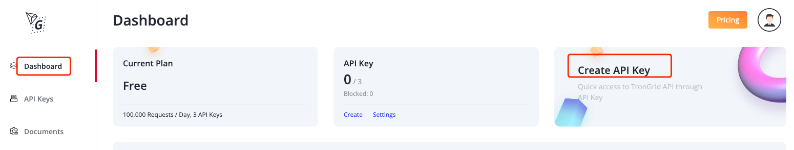
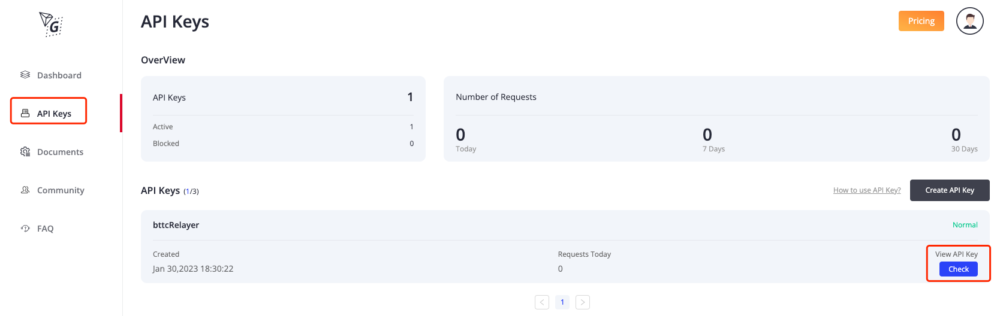
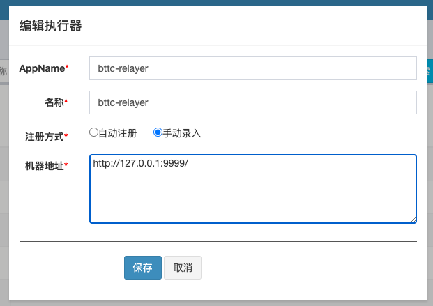

# Relayer 服务部署流程

* [Relayer 服务部署流程](#relayer-服务部署流程)
    * [1 Relayer 介绍](#1-relayer-介绍)
    * [2 依赖环境](#2-依赖环境)
    * [3 部署流程](#3-部署流程)
        * [3.1 数据库准备](#31-数据库准备)
            * [3.1.1 relayer 数据库初始化](#311-relayer-数据库初始化)
            * [3.1.2 relayer 数据库表内容介绍](#312-relayer-数据库表内容介绍)
        * [3.2 xxl-job 部署](#32-xxl-job-部署)
            * [3.2.1 xxl-job 服务部署](#321-xxl-job-服务部署)
            * [3.2.2 添加执行器](#322-添加执行器)
            * [3.2.3 添加 Job](#323-添加-job)
            * [3.2.4 启动 Job](#324-启动-job)
        * [3.3 部署 relayer 节点程序](#33-部署-relayer-节点程序)
            * [3.3.1 获取 relayer 节点程序](#331-获取-relayer-节点程序)
            * [3.3.2 节点配置](#332-节点配置)
            * [3.3.3 启动relayer服务](#333-启动relayer服务)
    * [4 服务可正常接单参考标准](#4-服务可正常接单参考标准)

## 1 Relayer 介绍

`relayer` 为 `bttc` 跨链取款交易的协助者，协助用户接收提取到主链的资产，并从该过程中获取手续费。

`relayer` 工作流程如下：
1. `relayer` 监听 `bttc` 侧链的取款交易，并筛选委托自己协助接收的交易;
2. `relayer` 监听主链的 `checkpoint` 交易，判断监听到的侧链取款交易是否已被该 `checkpoint` 打包。如果已打包，则进入第3步，否则继续监听;
3. 主链发起接收交易（即提交燃烧证明）
4. 接收交易固化，`relayer` 协助接收完成。

上述流程中，侧链指 `bttc` 链，主链指 `tron`、`eth`、`bsc` 三条链。本概念适用于全文。

`relayer` 详细介绍见 [什么是 Relayer](https://doc.bt.io/zh-Hans/docs/bridge/relayer)
，下文将介绍 `relayer` 的部署过程。

## 2 依赖环境

relayer 节点部署依赖以下环境：
- relayer 服务器建议：
    - CPU: 8 cores
    - 内存: 32G
    - 带宽: 100M
- relayer 节点依赖 MySQL。要求版本号8.0及以上；
- relayer 节点依赖 xxl-job 服务，可参考本文3.2《xxl-job部署》章节进行部署；
- relayer 节点使用 Java 语言编写，依赖 JRE/JDK 环境，请使用 JDK8；
- relayer 节点需要从 bttc、tron、eth、bsc 四个链上同步数据，故需要准备各链的 rpc/grpc 节点；
  如果开发者自己运行了上述四个链的节点，可以使用自己的节点，如果没有，则建议如下：
    - bttc、trongrid 使用 relayer 程序配置文件中默认值即可
    - bsc 可以使用数据库中默认配置节点，也可以使用官方节点，见 https://docs.bscscan.com/misc-tools-and-utilities/public-rpc-nodes
    - eth 可以使用数据库中默认配置节点，但是优先推荐购买以太坊的 infura 服务
- relayer 服务中需要用到 trongrid 的http服务，需要申请 trongrid api key，申请方式如下：
    - 打开 https://www.trongrid.io/
    - 注册账号并登陆
    - 点击 `Dashboard -> Create API Key -> 输入API name`

      
      

完成以上步骤后会自动生成 API key
- 查看 API key
  点击 `API Keys->点击check`，可以看到 API Key 具体信息

  

## 3 部署流程

### 3.1 数据库准备

#### 3.1.1 relayer 数据库初始化

数据库初始化脚本位于 relayer 节点程序中，具体位置如下：

- 测试环境sql文件：`/bttc-relayer/doc/db/tables_bttc_relayer_1029.sql`
- 主网环境sql文件：`/bttc-relayer/doc/db/tables_bttc_relayer.sql`

首先登陆mysql,假设本机mysql实例账号和密码均为root，执行以下语句登陆：
```sh
mysql -u'root' -p'root'
````
然后执行以下语句，创建所有表：

- 测试环境语句：
    ```sh
     source #{tables_bttc_relayer_1029 path}/tables_bttc_relayer_1029.sql
    ```
- 主网环境语句：
    ```sh
     source #{tables_bttc_relayer path}/tables_bttc_relayer.sql
    ```
其中`tables_bttc_relayer path`为 tables_bttc_relayer 文件存放路径

**如果用户需要使用自己的 eth、bsc 节点，则需要额外向数据库中插入节点信息：**
- 首先切换到 relayer 数据库
    - 测试环境执行如下语句
      ```sh
      use bttc_relayer_1029;
      ```
    - 主网环境执行如下语句
      ```sh
      use bttc_relayer;
      ```

- 然后插入节点信息
    - 假如需要增加的eth节点为 `https://eth.trongrid.io`, 则执行语句
      ```sh
      INSERT INTO event_url_config VALUES (1, 'eth', 'https://eth.trongrid.io');
      ```
    - 假如需要增加的bsc节点为 `https://bsc.trongrid.io`, 则执行语句
      ```sh
      INSERT INTO event_url_config VALUES (2, 'bsc', 'https://bsc.trongrid.io');
      ```
#### 3.1.2 relayer 数据库表内容介绍

relayer 节点程序中共包含5个表,各表功能如下：
1. transactions 表，每条数据存储的是一条完整的取款交易信息，包含用户发起指定本 relayer 接收的侧链取款交易以及
   relayer 在主链发起的协助接收的交易信息。
2. token_map 表，存储 bttc 中支持跨链的 token 信息
3. message_center_config 表，存储各链的最新块以及各个定时任务的解析进度
4. check_point_info 表，用于存储从链上同步的 check point 信息，relayer 节点程序根据该信息确定指定本节点接收的
   取款交易是否可以发起接收
5. event_url_config 表，存储 eth 和 bsc 的 rpc 节点

### 3.2 xxl-job 部署

`xxl-job` 是一个分布式任务调度平台，可方便的进行任务调度。现已开放源代码并接入多家公司线上产品线。

#### 3.2.1 xxl-job 服务部署

xxl-job 服务部署流程可参照官网文档：
- 官方文档：https://www.xuxueli.com/xxl-job/
- github 地址：https://github.com/xuxueli/xxl-job
- gitee 地址：http://gitee.com/xuxueli0323/xxl-job

成功部署 xxl-job 服务后，会生成可用的调度中心访问地址，若在本机部署 xxl-job 服务，且使用默认服务端口 `8080`，
则该地址为 `http://localhost:8080/xxl-job-admin` 。确保该地址可以成功登陆，则可进行下一步。

#### 3.2.2 添加执行器

部署完 xxl-job 后，进入调度中心访问地址，添加执行器，详见 xxl-job 官方文档章节 `4.1 《配置执行器》`：

1.点击左侧"执行器管理"->点击右上方"新增"，如下


2.新增执行器，示例如下：


其中AppName是每个执行器集群的唯一标示 AppName, 执行器会周期性以 AppName 为对象进行自动注册。

该信息需要配置到 relayer 节点的配置文件中，此处假设 AppName 设置为 bttc-relayer

#### 3.2.3 添加 Job

添加流程详见 xxl-job 官方文档 `2.5 《开发第一个任务“Hello World”》`。

1.点击任务管理 -> 页面左上方选择3.2.2中添加的执行器 -> 点击右上方新增，如下：


2.按照以下信息添加共12个 Job，对应 relayer 节点的12个定时任务。

- `高级配置项`，可统一配置如下：
    - `路由策略`:`第一个`
    - `阻塞处理策略`:`丢弃后续调度`
    - `任务超时时间`:600
    - `失败重试次数`:0
- 调度类型，统一配置为`CRON`

- 其他关键配置，各个任务配置不同，具体见下表：

| 任务描述                |           Cron |          JobHandler           |
|:--------------------:|:---------------:|:-----------------------------:|
| 更新最新块号              |  0/3 * * * * ? |       updateBlockNumber       |
| 侧链取款交易解析            |  0/6 * * * * ? |         bttcWithdraw          |
| 侧链取款交易解析-检查补充       |  0 0/1 * * * ? |        bttcWithdrawAdd        |
| 主网检查点提交解析-未确认       |  0 0/1 * * * ? | mainChainCheckpointUnConfirm  |
| 主网检查点提交解析-已确认       |  0 0/1 * * * ? | mainChainCheckpointConfirmed  |
| 主网检查点状态更新           | 0/15 * * * * ? |  updateTransactionsByMessage  |
| 主网检查点状态更新-检查补充      |  0 0/1 * * * ? |  mainChainCheckpointEnhance   |
| 主网提交燃烧证明（只针对正常交易）   |  0 0/1 * * * ? |    mainchainSubmitWithdraw    |
| 主网提交燃烧证明（只针对提交失败交易） |  0 0/5 * * * ? | mainchainSubmitWithdrawFailed |
| 更新正常交易状态            | 0/10 * * * * ? |    updateTransactionStatus    |
| 主链取款交易解析            |  0/6 * * * * ? |       mainChainWithdraw       |
| 主链取款交易解析-补充解析       |  0 0/1 * * * ? |     mainChainWithdrawAdd      |

3.以 updateBlockNumber 任务为例，设置如下：


#### 3.2.4 启动 Job

- 在上述工作完成，请先进行3.3部分 relayer 节点的部署。完成部署并启动了 relayer 节点，且 relayer 节点在 XXL-JOB 服务上注册成功后，启动 job，方式如下：

点击"操作" -> "启动"，如下：


可以通过调度日志，查看定时任务执行结果。如果所有任务都成功了至少一次，则说明启动成功。（开始会有几次任务失败，是正常的）

确认节点在XXL-JOB服务上注册成功方式如下：

可通过下图确认relayer节点在XXL-JOB服务上是否注册成功。


如果未出现relayer节点服务器信息，则可以通过xxl-job服务日志，查看注册失败原因,
可尝试将执行器注册方式改为手动录入,添加relayer节点服务器"ip:回调端口"如下图：



### 3.3 部署 relayer 节点程序

#### 3.3.1 获取 relayer 节点程序

relayer 节点代码位于github上，已开源，位于 `https://github.com/bttcprotocol/bttc-relayer` ，可通过如下命令下载：
```sh
git clone git@github.com:bttcprotocol/bttc-relayer.git
```
#### 3.3.2 节点配置

relayer 节点配置文件均位于 `/src/main/resources` 目录下。

其中 `application-pretest` 为 bttc 测试网的 relayer 节点配置文件，`application-prod` 为 bttc 主网的 relayer 节点配置文件。

配置文件中，合约配置和部分url配置不可更改，其他内容需要开发者自行配置，涉及内容如下：

1.数据库信息

数据库创建详见3.1节
```sh
spring:
    datasource:
        url: 数据库url
        username: 数据库username
        password: 数据库password
```
2.relayer 节点http服务端口

relayer 节点提供 http 接口供查询 relayer 节点服务是否在线。

假如 relayer 节点ip为 10.10.10.10，且 http 服务端口设置为8081，
则供查询 relayer 节点服务是否在线的url是 `http://10.10.10.10:8081/status/info` 。

在进行 relayer 申请,填写 relayer 信息时，"Relayer 服务地址"处需要填写本接口。

请务必保证该接口可用，在申请 relayer 时，如果该接口不可用，会导致申请不成功；在正式成为 relayer 后，如果该接口不可用，会导致无法正常接单
```sh
server:
    port: relayer节点http服务端口
```
3.trongrid http 服务的 api key

申请方式见第2章《依赖环境》第5条
```sh
client:
    tron:
        api:
            name: trongrid api key name
                key: trongrid api key
```
注意：trongrid 测试网和主网申请方式相同，为保证 trongrid 主网访问频率不受影响，请勿与测试环境使用同一套 api key;

4.xxl-job配置

xxl-job配置详见3.2节
 ```sh
xxl:
    job:
        admin:
            addresses: xxl-job调度中心访问地址, 如http://localhost:8080/xxl-job-admin
        executor:
            appname: 执行器名称, 如"bttc-relayer"
            port: 执行器供xxl-job回调的接口, 如9999
```
注意：请确保运行relayer node的服务器和运行xxl-job的服务器可以相互访问相关节点，否则xxl-job调度会失败。
以上述配置为例，运行relayer node的服务器可以访问xxl-job服务器的8080端口，xxl-job服务器可以访问relayer node服务器的9999端口

5.slack配置
 ```sh
client:
    slack:
        url: slack url,用于接收relayer执行过程中遇到的错误信息, 如果开发者没有slack, 则本配置可以不改动, 只是无法收到报警信息
```
6.定时任务起始区块配置

侧链取款、主链取款和checkpoint定时任务在第一次执行时需要设置一个解析任务起始块，指定该任务从哪个区块开始解析，
后续会从message_center_config数据库中读取解析进度。

由于开发者在初次部署时，尚未成为正式的relayer，尚未接单，故无需关心历史数据，
建议将各链的初始解析区块设置为当前的最新块基础上减去1000。
```sh
parseData:
    tronInitBlockNumber: tron链起始解析块号
    ethInitBlockNumber: eth链起始解析块号
    bscInitBlockNumber: bsc链起始解析块号
    bttcInitBlockNumber: bttc链起始解析块号
```
注意：如果配置的起始块距离当前块太多，会需要较长时间才能同步到最新块，需要同步到最新块后才能开始接单。
否则可能导致在规定时间内解析不到指定自己接收的交易，无法协助用户接收，从而被惩罚。

7. 交易超时时间配置(可使用配置文件中的默认配置)

   交易超时分为交易上链超时和交易固化超时：
    - 交易上链超时即在规定时间内，主链接收交易未成功上链；
    - 交易固化超时即主链接收交易所在块分叉了，最终未固化。
      对于以上两种情况，会在定时任务mainchainSubmitWithdrawFailed中重新发起交易。
```sh
parseData:
  parseTimeout: 交易上链超时时间(单位为分钟)
  confirmTimeout: 交易固化超时时间(单位为分钟)
```
注意，超时时间不要设置太长，可能会导致超过规定的协助接收时间

8. relayer信息配置
```sh
relayer:
    address:
        bttc: relayer在bttc上账户地址,即申请relayer的账户地址
    defaultGasPrice:
        eth: eth上提交交易时,默认使用的gas price
        bsc: bsc上提交交易时,默认使用的gas price
    defaultGasPriceLimit:
        eth: eth上提交交易时,使用的最大的gas price,超过该值,则暂时不进行协助接收
        bsc: bsc上提交交易时,使用的最大的gas price,超过该值,则暂时不进行协助接收
    key: relayer的主链账户地址对应的密钥,目前程序配置三个主链地址对应同一个密钥,如果开发者主链地址对应不同的密钥, 则需要开发者自行更改程序
```
::: tip
key为relayer主链账户地址私钥，安全性考虑，建议在生产环境需要设定配置文件权限为600, 即只有拥有者可读写。
:::

#### 3.3.3 启动relayer服务

注意：需要完成数据库准备和xxl-job部署后（即本文3.1、3.2），方可启动本程序。
在bttc-relayer目录下,执行以下命令启动
```sh
#compile
./gradlew build -x test

##切到lib目录
cd build/libs

##创建logs目录，存放log日志
mkdir logs

#deploy
nohup java -Xms16g -Xmx16g -XX:+UseG1GC -XX:+PrintGCDetails -Xloggc:./logs/gc.log -XX:+PrintGCDateStamps -XX:+HeapDumpOnOutOfMemoryError -Ddruid.mysql.usePingMethod=false -Dspring.profiles.active=$profile -jar bttc-relayer-1.0-SNAPSHOT.jar >/dev/null 2>&1 &
```
其中：$profile指使用的配置文件，如测试环境，该语句为，
nohup java -Xms16g -Xmx16g -XX:+UseG1GC -XX:+PrintGCDetails -Xloggc:./logs/gc.log -XX:+PrintGCDateStamps -XX:+HeapDumpOnOutOfMemoryError -Ddruid.mysql.usePingMethod=false -Dspring.profiles.active=pretest -jar bttc-relayer-1.0-SNAPSHOT.jar >/dev/null 2>&1 &

执行以下命令查看日志：

查看log信息：
```sh
tail -f logs/info.log
```
查看warn信息：
```sh
tail -f logs/warn.log
```

查看error信息：
```sh
tail -f logs/error.log
```

## 4 服务可正常接单参考标准

上述服务搭建完成，并正常启动后，如果满足以下两个条件，则说明服务已经可以正常接单。

1.xxl-job 任务调度正常，可通过查看调度日志确认。（偶尔因为`block strategy effect：Discard Later`导致任务执行失败，可忽略）

2.`message_center_config` 表中记录的各定时任务的进度正常，即达到下述标准。
如果未达到下述标准，需要等待 relayer 节点服务继续运行，至达到该表标准(如果下表中块号长时间无变化，需要查看error日志查看原因)。

- 主链包含以下各定时任务解析块进度记录：

| contract_address                 |                    任务含义 |                            任务同步参考标准                             |
|:---------------------------------:|:------------------------:|:---------------------------------------------------------------:|
| BlockNumber                      |           主链最新固化/非固化区块号 |                     该块号时间与链上最新块号相时间相差2分钟以内                      |
| MainChainCheckpoint              | 主链checkpoint交易同步任务已同步块号 |                      与BlockNumber值相差500块以内                      |
| MainChainWithdraw-chaintoken     |        主链本链币取款同步任务已同步块号 |                      与BlockNumber值相差500块以内                      |
| MainChainWithdraw-erc            |      主链erc20取款同步任务已同步块号 |                      与BlockNumber值相差500块以内                      |
| MainChainCheckpoint-enhance      |    最新checkpoint解析任务同步块号 |                    值大于等于主链上最新checkpoint所在区块号                    |
| MainChainWithdraw-chaintoken-Add |      主链本链币取款补充同步任务已同步块号 | 对于tron、bsc链，与BlockNumber值相差1100块以内; 对于eth，与BlockNumber值相差630块以内 |
| MainChainWithdraw-erc-Add        |    主链erc20取款补充同步任务已同步块号 | 对于tron、bsc链，与BlockNumber值相差1100块以内; 对于eth，与BlockNumber值相差630块以内 |

- 侧链包含以下各定时任务解析块进度记录：

| contract_address |             任务含义 |        任务同步正常标准        |
|:-----------------:|:-----------------:|:----------------------:|
| BlockNumber      | bttc链最新固化/非固化区块号 | 该块号时间与链上最新块号相时间相差2分钟以内 |
| BttcWithdraw     |    侧链取款同步任务已同步块号 | 与BlockNumber值相差500块以内  |
| BttcWithdrawAdd  |  侧链取款补充同步任务已同步块号 | 与BlockNumber值相差800块以内  |

注：
`max_unconfirm_block`列为任务解析的固化块号。
`max_unconfirm_block`列为任务解析的非固化块号，只有`BlockNumber`和`MainChainCheckpoint`两个定时任务会解析非固化块，
因此对于`max_unconfirm_block`列，只有`contract_address`为`BlockNumber`和`MainChainCheckpoint`的数据值不为0。
