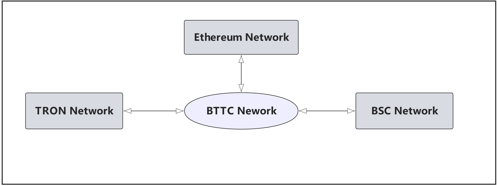

import Tabs from '@theme/Tabs';
import TabItem from '@theme/TabItem';

# 网络详情

<Tabs
  defaultValue="mainnet"
  values={[
    { label: 'BTTC-主网', value: 'mainnet', },
    { label: 'BTTC-测试网', value: 'donau', },
  ]
}>

<TabItem value="mainnet">

BTTC是TRON/BSC/Ethereum网络一个二层网络， 下面是主网的网络结构：

## BTTC网络

* 网络名称：BitTorrent Chain Mainnet
* RPC URL 1：https://rpc.bt.io
* RPC URL 2: https://bttc.trongrid.io
* 链ID：`199` 
* 货币符号：BTT
* 区块览器1：https://scan.bt.io
* 区块览器2：https://bttcscan.com

## ETH 网络

* 网络名称: Ethereum 主网络
* RPC URL: https://mainnet.infura.io/v3
* 链ID: `1`
* 货币符号: ETH
* 区块浏览器: https://etherscan.io

## BSC 网络

* 网络名称: Binance Smart Chain
* RPC URL: https://bsc-dataseed.binance.org/
* 链ID: `56`
* 货币符号: BNB
* 区块浏览器: https://bscscan.com

## TRON 网络
使用Tronlink Chrome插件连接到TRON网络，登录Tronlink钱包后需要切换主网。

* RPC URL：https://api.trongrid.io
* 区块浏览器：https://tronscan.org

</TabItem>
<TabItem value="donau">

BTTC是TRON/BSC/Ethereum网络一个二层网络， 下面是测试网的网络结构：

## BTTC Donau测试网
BTTC Donau测试网的接入需要使用Metamask钱包，在Metamask钱包中添加自定义RPC网络，参数如下：
* 网络名称：BitTorrent Chain Donau
* RPC URL：https://pre-rpc.bt.io/ 
* ChainID：`1029`
* Symbol：BTT
* 区块浏览器 1: https://testscan.bt.io
* 区块浏览器 2: https://testnet.bttcscan.com
* WebSocket：wss://pre-rpc.bt.io:8546

## ETH Goerli测试网
Goerli测试网的接入需要使用Metamask钱包，在Metamask钱包中添加自定义RPC网络，详细操作流程可参考：[Metamask链接Goerli网络](https://mudit.blog/getting-started-goerli-testnet/)，参数如下：
* 网络名称：Goerli - Testnet
* RPC URL：https://goerli.infura.io/v3/9aa3d95b3bc440fa88ea12eaa4456161
* 链ID：`5`
* 货币符号：ETH
* 区块浏览器：https://goerli.etherscan.com

## BSC测试网
BSC测试网的接入需要使用Metamask钱包，在Metamask钱包中添加自定义RPC网络，详细操作流程可参考：[Metamaskl连接BSC网络](https://academy.binance.com/en/articles/connecting-metamask-to-binance-smart-chain), 参数如下：
* 网络名称：Binace Smart Chain - Testnet
* RPC URL：https://data-seed-prebsc-1-s1.binance.org:8545/
* 链ID：`97`
* 货币符号：BNB
* 区块浏览器：https://testnet.bscscan.com

## TRON Nile 测试网

TRON Nile测试网的接入需要使用Tronlink Chrome插件，并且Tronlink已支持Nile，用户在登录Tronlink钱包后需要切换至Nile测试网，通过水龙头申请测试币并发送至Tronlink账号，即可完成Nile测试网环境准备。
* 官网地址：https://nileex.io
* 区块浏览器：https://nile.tronscan.org

</TabItem>
</Tabs>
