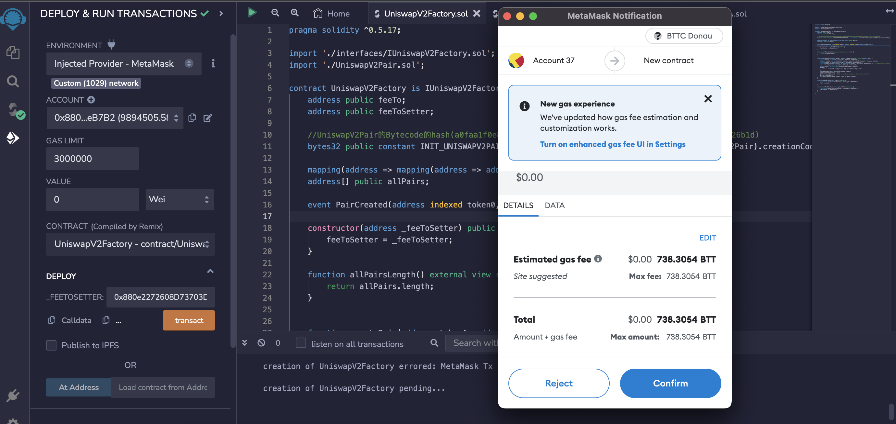
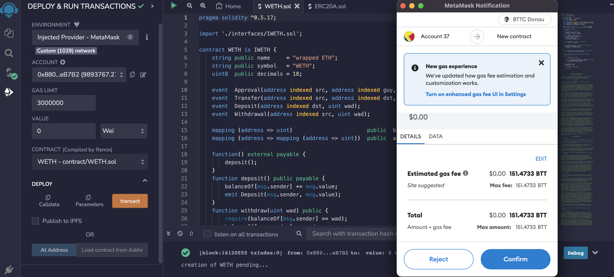
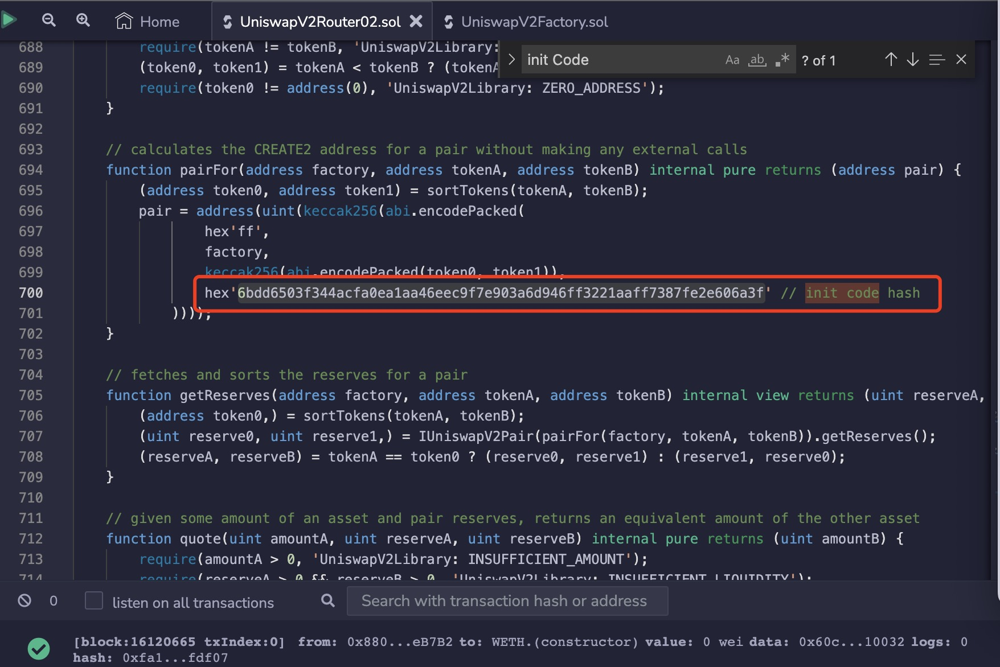
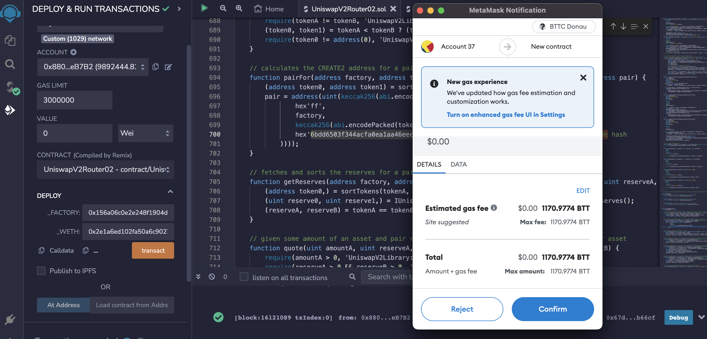
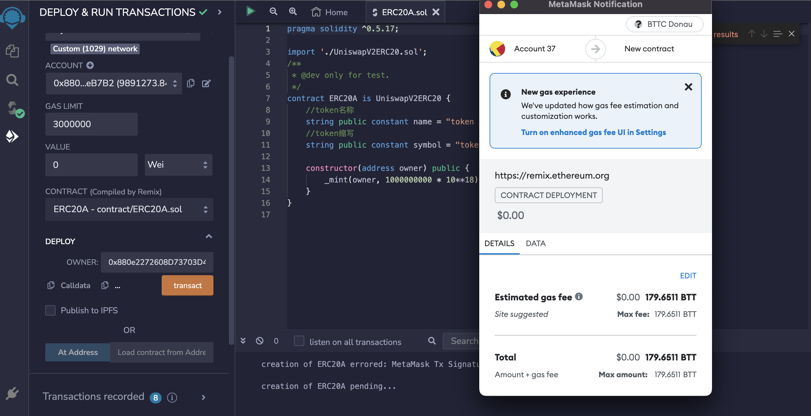

# 以太坊DApp快速迁移教程

为了让开发者可以更快更容易的将以太坊DApp迁移至BTTC网络，本文将以迁移uniswap为例，基于现有以太坊开发工具Remix对DApp合约迁移和前端界面迁移进行具体的介绍。

## BTTC和以太坊的不同

BTTC网络底层兼容以太坊EVM，对于DAPP开发者来说，迁移的工作量将减少许多，使得迁移过程能够更平滑，不过其中有一些差异的地方在某些DAPP迁移过程中需要注意：
* token的单位：BTTC使用BTT代替了以太坊的wei、ether。
* 账户地址格式：BTTC使用与以太坊地址相同的地址格式。
* BTTC网络相关RPC信息可参考文档 [网络](https://doc.bt.io/zh-Hans/docs/networks/network)。

## DAPP迁移思路

迁移DApp可以参考如下迁移思路：

1. 梳理DApp的主要功能，按功能依赖关系进行排序，以Uniswap为例，功能依赖关系为： 
    * MetaMask增加BTTC网络配置([节点信息](https://doc.bt.io/zh-Hans/docs/networks/network))
    * 连接MetaMask钱包
    * swap界面展示代币及显示余额
    * 能够创建交易对并添加流动性
    * 能够操作swap
    * 能够移除流动性。

    MetaMask配置BTTC测试网节点：

    * 网络名称:BTTC Donau Testnet
    * RPC URL: https://pre-rpc.bt.io/
    * 链ID:1029
    * 符号(选填):BTT
    * 区块浏览器: https://testscan.bt.io

2. 根据下文的[uniswap合约迁移](#uniswap合约迁移)章节迁移DApp相关合约，部署到BTTC测试网络。
3. 根据第1步梳理功能依赖和下文的[uniswap前端代码修改](#uniswap前端代码修改)，依次调试通过每一个功能。


## uniswap迁移

为了让开发者更好更快的将以太坊DAPP迁移至BTTC网络，我们以uniswap为例子详细讲述迁移的过程及修改点。uniswap在业务流程及复杂性上在DAPP中都算比较大的，因此uniswap的迁移例子会更有代表性。

### uniswap业务流程

* 连接MetaMask钱包，选择账户连接，连接成功后uniswap前端能够显示连接的账户及账户的原生代币余额。
* 在swap界面上点击选择相对代币能够展示各个代币的余额。
* 在pool界面可以创建交易对并增加流动性(需要唤醒MetaMask同意授权以及签名等) ,操作成功后可以在页面展示出创建的交易对流动性，点击流动性详情页面的remove可以按百分比等移除对应的流动性。
* 切换回swap界面可以在创建的交易对里的代币间进行swap操作(需要唤醒MetaMask签名)。

### uniswap合约迁移

Uniswap合约代码请参考：[swap-contracts](https://github.com/treelaketreelake/swap-contracts)，下面是合约部署的具体。

#### 前期准备
1. 安装Metamask钱包及配置BTTC网络，详细操作参考文档 [钱包](https://doc.bt.io/zh-Hans/docs/wallet#metamask) 章节。
2. 本次操作使用BTTC Donau测试网，测试币可通过[水龙头](https://testfaucet.bt.io/#/)申请。

#### 使用在线RemixIDE工具

使用[RemixIDE](https://remix.ethereum.org/)工具部署合约详细流程可参考 [部署合约](https://doc.bt.io/zh-Hans/docs/smartcontract/deploy-contracts) 文档。其中，主要部署如下uniswap交易对相关合约：
* uniswapV2Factory
* WETH
* Multicall
* uniswapV2Router02
* ERC20A，ERC20B（测试代币）

编译相关合约：

* 编译uniswapV2Factory合约：
* 编译WETH合约：
* 编译uniswapV2Router02合约：
* 编译ERC20A/ERC20B合约：


部署上述合约至BTTC Donau测试网，RemixIDE中将ENVIRONMENT选择Injected Provider - MetaMask：

* 部署uniswapV2Factory合约，其中feeToSettter值为合约部署者。



* 部署WETH合约


* 部署Muticall合约


* 部署uniswapV2Router02合约
**首先获取initCode**，编译UniswapV2Pair合约，获取pair字节码，得到object字段内容，打开 [网址](http://emn178.github.io/online-tools/keccak_256.html)，将刚才得到的object字段内容粘贴，选择input type HEX,如下图得到initCode。

替换uniswapV2Router02合约中的initCode

最后，部署uniswapV2Router02合约



* 部署ERC20A/ERC20B合约


* 记录部署合约地址信息
    ```javascript
    uniswapV2Factory at: 0x156a06c0e2e248f1904d0c089ad7b8f557f5bd1f
    WETH at: 0x2e1a6ed102fa50a6c9027c9c031245ec157010ed
    uniswapV2Router02 at: 0x49d769b538921525d74ed87445c9a079f82548ee
    Multicall at:0x59bc158d32033138e454604c03d4c9b1a1befa44
    initHash at: 0x1a6d2ed3e4401e99398dc98ed6292bad49c7e0760d0026a54c1c7597c227373b
    ERC20A at:0xf426e0995542bf01a07b97d9f8dcd684ccce005e
    ERC20B at: 0x734f54b414d63b788aff5aef1dbc9616cf8d8a9a
    ```

### uniswap依赖库修改

包名：uniswap-sdk
源码地址: [https://github.com/Uniswap/v2-sdk/tree/a88048e9c4198a5bdaea00883ca00c8c8e582605](https://github.com/Uniswap/v2-sdk/tree/a88048e9c4198a5bdaea00883ca00c8c8e582605)
#### 修改位置：src/constants.ts 
首先将FACTORY_ADDRESS和INIT_CODE_HASH替换成新部署生成的对应的数据。然后在chainId枚举中增加BTTC Donau测试网。
```javascript
export const FACTORY_ADDRESS='0x156a06c0e2e248f1904d0c089ad7b8f557f5bd1f'
export const INIT_CODE_HASH='0x1a6d2ed3e4401e99398dc98ed6292bad49c7e0760d0026a54c1c7597c227373b'

export enum ChainId {
  MAINNET = 1,
  ROPSTEN = 3,
  RINKEBY = 4,
  GÖRLI = 5,
  KOVAN = 42,
  BTTC =1029
}
```


#### 修改src/entities/token.ts
将下面的地址替换成新部署生成的WETH代币地址。修改完依赖包的代码后编译生成dist目录替换掉安装的之前的依赖的dist目录即可。

```javascript
export const WETH = {
[ChainId.BTTC]: new Token(
  ChainId.BTTC,
  '0x2e1a6ed102fa50a6c9027c9c031245ec157010ed',
  18,
  'WETH',
  'Wrapped ETH'
),,
```


### uniswap前端代码修改

注⚠️：目前Uniswap前端版本较多，各个版本之间可能存在一些差别，本文将使用[uniswap-interface-2.6.0](https://github.com/Uniswap/interface/tree/v2.6.0)版本为例。

#### 修改src/connectors/index.ts
supportedChainIds增加BTTC Donau测试网对应的chainId。
```javascript
export const injected = new InjectedConnector({
supportedChainIds: [1, 3, 4, 5, 42,1029]
})
```


#### 修改src/constants/index.ts
将ROUTER_ADDRESS替换成新部署生成的router合约地址。
```javascript
export const ROUTER_ADDRESS = '0x49d769b538921525d74ed87445c9a079f82548ee'
```


#### 修改src/constants/multicall/index.ts
MULTICALL_NETWORKS新增加BTTC Donau测试网及对应的multicall合约地址。

```javascript
[ChainId.BTTC]:'0x59bc158d32033138e454604c03d4c9b1a1befa44'
```


#### 修改src/constants/list.ts

```javascript
exportconstDEFAULT_TOKEN_LIST_URL='http://yourIP/token-list.json'
```

#### 测试
执行yarn start，进行后续的测试工作。


### uniswap迁移总结

* swap源代码及依赖库@uniswap/sdk 中增加BTTC网络配置，支持chainId为`1029`的BTTC Donau测试网。
* 修改业务相关的合约的依赖合约UniswapV2Library中的init code hash对应代码，然后部署业务相关的合约(uniswapV2Factory/WETH/uniswapV2Router/multicall)，获取相关合约的地址。
* 替换swap源代码中的相关业务的合约地址(uniswapV2Factory/WETH/uniswapV2Router/multicall/initHash)。
* 替换@uniswap/sdk代码中相关业务的合约地址(uniswapV2Factory/WETH/uniswapV2Router/multicall/initHash)。

## DAPP迁移总结

上面uniswap的迁移为例，涉及到的主要调整是由于业务需要导致。比如支持新的网络需要进行适配改动，以及因业务类的合约需要重新部署合约地址的改动或者添加。所以在迁移之前，首先对Dapp进行业务逻辑梳理是非常重要的一步，后续迁移也将非常平滑。
