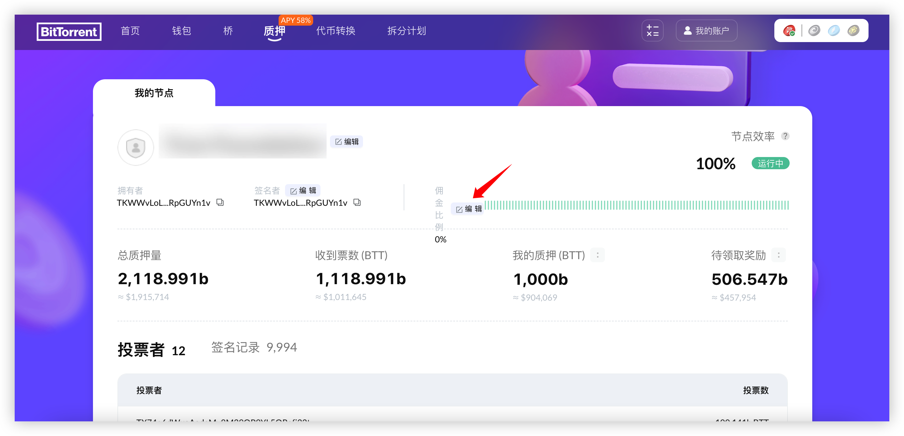
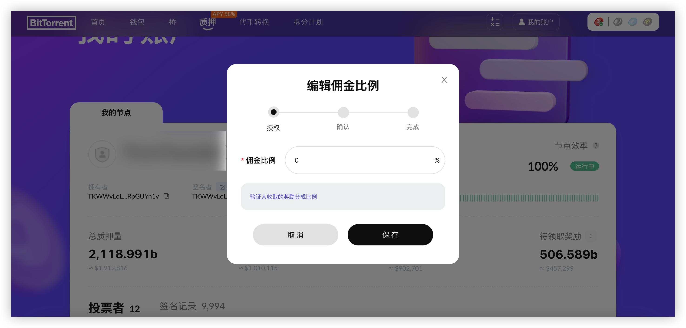

# 佣金比例

佣金比例是验证人能从委托收益中分成的比例, 作为验证人可以设置或者更新自己的[佣金比例](/docs/validator/glossary#佣金)。

验证人可以根据自己的需求调整佣金比例，最低佣金比例可以设置为0%，最高佣金比例可以设置成奖励的100%，更低的佣金比例可以吸引更多的委托人的委托投票。

作为验证人，您应该及时通知社区有关佣金比例的变化，参考[验证人职责](/docs/validator/responsibilities)。 

## 修改佣金比率

验证人可以根据自己的需求调整佣金比率：

1. 使用验证人Owner地址登录[质押面板](https://bt.io/staking/myAccount)。
2. 在"我的账户"中的选择"我的节点"页面，点击佣金率右侧的**编辑**按钮。

4. 输入你的新佣金比例，点击**保存**按钮。

一旦您确认并签名交易，您的佣金比例将被修改。

一旦佣金比例被更新，将有一个80个检查点的冷却期，在冷却期内无法再次修改佣金比例，直至冷却期结束。

