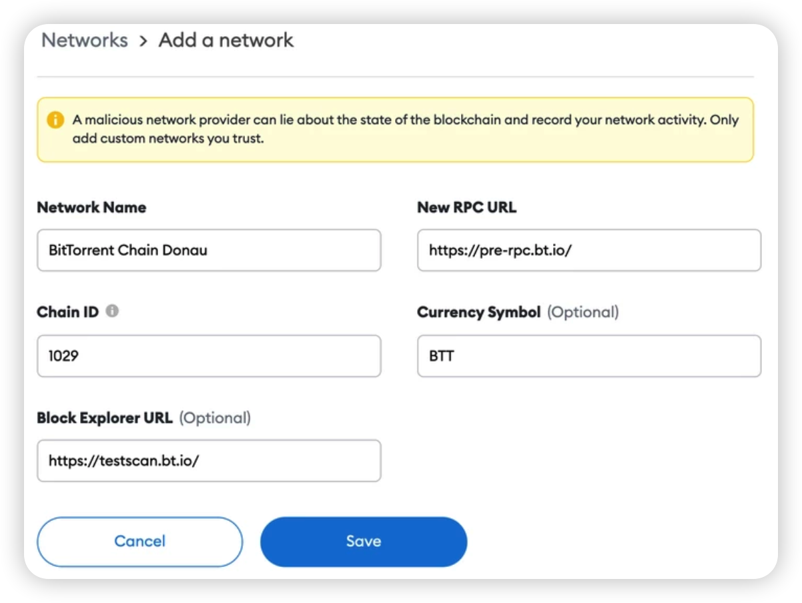
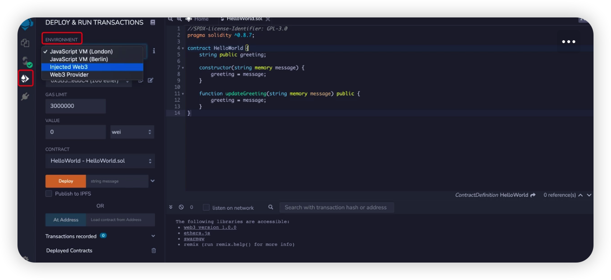
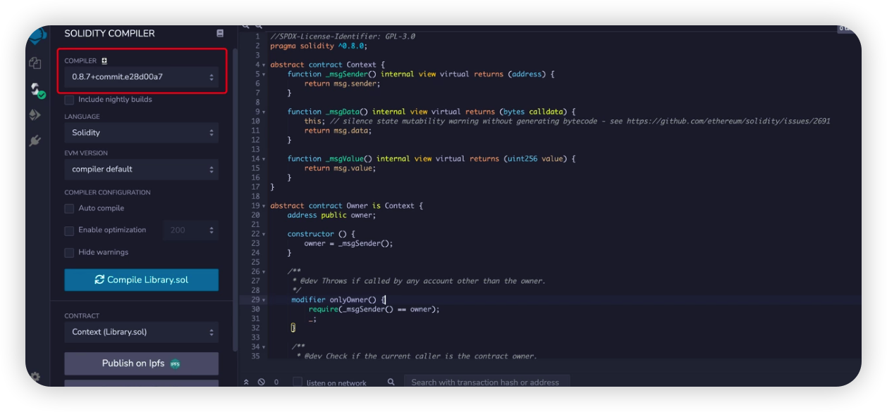
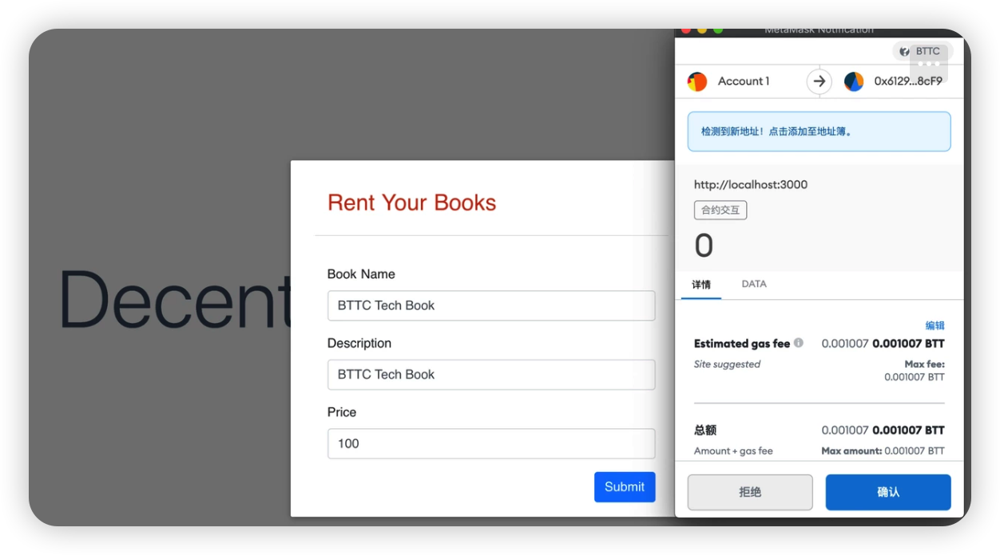

import useBaseUrl from '@docusaurus/useBaseUrl'

# 開發一個WEB3應用
本文是一個從零到一的DApp開發教程，包括了從編寫合約和UI交互到部署上線的一套完整流程，通過學習構建一個去中心化的圖書館，使開發者能夠輕松掌握如何在BTTC網絡上部署自己的DApp。
## 開發前準備

### Nodej v10+

```sh
node -v
v10.24.1
```

### Metamask

在[這里](https://chrome.google.com/webstore/detail/metamask/nkbihfbeogaeaoehlefnkodbefgpgknn)安裝Metamask的Google Chrome插件。

## 我們在做什麽？

我們將要構建一個包括以下功能的去中心化圖書館：

* 租書
* 查看可借書目
* 添加書

## 數據結構

對於借書者來說，通常，需要關心書的名字、內容、是否可借以及價格。基於此，我們在合約中創建一個名為Book的結構，它包括了如下的屬性：

```js
struct Book {
       string name;
       string description;
       bool valid; // false if been borrowed
       uint256 price; // BTT per day
       address owner; // owner of the book
   }
```

我們希望圖書館能通過一個映射來記錄每一本書。為此，這里分別創建了一個bookId的屬性，以及bookId到Book的映射關系，命名為books。

```js
uint256 public bookId;

mapping (uint256 => Book) public books;
```

我們還需要記錄每一本書的租借信息，包括借書者以及起止時間。

與Book相同，創建一個名為Tracking的結構來記錄這些信息。這個結構包含了下面的屬性：

```js
struct Tracking {
       uint256 bookId;
       uint256 startTime; // start time, in timestamp
       uint256 endTime; // end time, in timestamp
       address borrower; // borrower's address
   }
```

同樣的，我們也需要建立一種映射關系，來管理每一次租借記錄：

```js
uint256 public trackingId;

mapping(uint256 => Tracking) public trackings;
```

### 定義功能和事件

我們需要為圖書館添加一些基本功能，包括：

* 為圖書館添加書籍 - addBook
* 借一本書 - borrowBook
* 從圖書館移除這本書 - deleteBook

#### addBook

```js
/**
    * @dev Add a Book with predefined `name`, `description` and `price`
    * to the library.
    *
    * Returns a boolean value indicating whether the operation succeeded.
    *
    * Emits a {NewBook} event.
    */
   function addBook(string memory name, string memory description, uint256 price) public returns (bool) {
       Book memory book = Book(name, description, true, price, _msgSender());

       books[bookId] = book;

       emit NewBook(bookId++);

       return true;
   }

   /**
    * @dev Emitted when a new book is added to the library.
    * Note bookId starts from 0.
    */
   event NewBook(uint256 bookId);
```

#### borrowBook

```js
   /**
    * @dev Borrow a book has `_bookId`. The rental period starts from
    * `startTime` ends with `endTime`.
    *
    * Returns a boolean value indicating whether the operation succeeded.
    *
    * Emits a `NewRental` event.
    */
   function borrowBook(uint256 _bookId, uint256 startTime, uint256 endTime) public payable returns(bool) {
       Book storage book = books[_bookId];

       require(book.valid == true, "The book is currently on loan");

       require(_msgValue() == book.price * _days(startTime, endTime), "Incorrect fund sent.");

       _sendBTT(book.owner, _msgValue());

       _createTracking(_bookId, startTime, endTime);

       emit NewRental(_bookId, trackingId++);
   }
```

#### deleteBook

```js
/**
    * @dev Delete a book from the library. Only the book's owner or the
    * library's owner is authorised for this operation.
    *
    * Returns a boolean value indicating whether the operation succeeded.
    *
    * Emits a `DeleteBook` event.
    */
   function deleteBook(uint256 _bookId) public returns(bool) {
       require(_msgSender() == books[_bookId].owner || isOwner(),
               "You are not authorised to delete this book.");
      
       delete books[_bookId];

       emit DeleteBook(_bookId);

       return true;
   }
```

在borrowBook方法中，我們用到了兩個工具方法_sendBTT和_createTracking。我們不希望用戶調用這些方法，因此，遵照Solidity的規則，我們把它們標記為internal，表示僅能在合約內部被調用。

#### _sendBTT

```js
/**
    * @dev Send BTT to the book's owner.
    */
   function _sendBTT(address receiver, uint256 value) internal {
       payable(address(uint160(receiver))).transfer(value);
   }
```

#### _createTracking

```js
/**
    * @dev Create a new rental tracking.
    */
   function _createTracking(uint256 _bookId, uint256 startTime, uint256 endTime) internal {
         trackings[trackingId] = Tracking(_bookId, startTime, endTime, _msgSender());

         Book storage book = books[_bookId];

         book.valid = false;
   }
```

現在我們已經完成了合約的編寫工作，接下來就該部署上線了。

## 部署和測試

我們用[Remix](https://remix.ethereum.org/)來編譯和部署合約。

部署合約需要燃燒BTT以支付gas。

打開MetaMask錢包，並在如圖的下拉選單中選擇Custom RPC


按照圖中的信息填寫：

* 網絡名稱（Network Name）：BitTorrent Chain Donau
* RPC URL（RPC URL）：https://pre-rpc.bt.io/ 
* 智能鏈ID（ChainID）：1029
* 符號（Symbol）：BTT
* 區塊瀏覽器URL（Block Explorer URL）：https://testscan.bt.io/




首先，在Remix的DEPLOY & RUN TRANSACTIONS欄中，從Environment的下拉菜單里選擇Injected Web3




選擇0.8.0以及更高版本的編譯器




點擊Deploy後，MetaMask會彈出交易確認的窗口


恭喜，Library合約已經成功部署到了BTTC的測試網，現在您可以與它進行交互了，同時可以在瀏覽器上檢查它的狀態。

## 構建DApp

首先將上一步部署的合約地址粘貼到 utils.js 中的 libraryContractAddress 變量中。

#### 連接UI到Metamask

下一步我們需要將UI連接到Metamask Chrome 錢包,  Metamask Chrome擴展程序會將Web3對象注入每個瀏覽器頁面，使得 DApp 能與 BTTC 網絡進行交互。

在dapp-ui/plugins/utils.js中，創建如下函數來獲取智能合約對象，並將其保存到全局變量中,接下來就可以直接使用全局變量來與合約交互了。

```js
export async function setLibraryContract() {
     var MyContract = web3.eth.contract(LibraryABI); 
     bookRentContract = await MyContract.at('0xe7BBc13a279f11D313B2c8304CdcDfC856C7603C');
}
```

### 定義功能和函數

當我們的UI能夠連接到Metamask之後，我要考慮我們的UI如何跟智能合約進行交互。所以我們要創建一個合約合約對象，表示去中心化圖書館智能合約。

圖書館DApp需要支持三個主要功能：

* 為圖書館添加書籍
* 查看所有可借書籍
* 借書

在index.vue中調用setLibraryContract()初始化合約對象。

```js
 async mounted() {
   // init contract object
   await setLibraryContract();
   // fetch all books
   const books = await fetchAllBooks();
   this.posts = books;
 },
```

#### 添加書籍

首先創建添加書籍表單，用於用戶發布書籍出租信息。在後端，它將與library合約的addBook函數交互。

在dapp-ui/components/bookForm.vue的postAd()函數中添加如下代碼：

```js
 postAd() {
     postBookInfo(this.title,this.description,this.price);
 }
```

在dapp-ui/plugins/utils.js的postBookInfo()中添加如下代碼：

```js
const result = await bookRentContract.methods.addBook(name,description,price).send();
```

#### 查詢所有可借書籍

通過`fetchAllBooks()`函數獲取書籍列表，列出所有可借書籍。

在dapp-ui/plugins/utils.js的fetchAllBooks()函數中添加如下代碼：

```js
 const books = [];

 const bookId  = await bookRentContract.methods.bookId().call();
 //iterate from 0 till bookId
 for (let i = 0; i < bookId; i++){
   const book = await bookRentContract.methods.books(i).call()
   if(book.name!="") // filter the deleted books
   {
     books.push(
       {id: i,name: book.name,description: book.description,price: book.price}
     )
   } 
 }
return books
```

在index.vue中調用`fetchAllBooks()`來獲取書籍信息，並顯示到主頁上。

#### 借閱書籍

用戶查看書籍信息後，可以借閱這本書。

在dapp-ui/components/detailsModal.vue的book()函數中添加如下代碼：

```js
     // get Start date
     const startDay = this.getDayOfYear(this.startDate)
     // get End date
     const endDay = this.getDayOfYear(this.endDate)
     // price calculation
     const totalPrice =this.propData.price * (endDay - startDay)
     // call metamask.bookProperty
     borrowBook(this.propData.id, startDay, endDay, totalPrice)
```

dapp-ui/plugins/utils.js，在borrowBook()函數中添加如下代碼：

```js
 const result = await bookRentContract.methods.borrowBook(spaceId,checkInDate,checkOutDate).send();
```

至此，圖書館DApp開發完畢。

## 運行DApp

確保Metamask為登錄狀態，然後執行如下命令來啟動服務：

```sh
npm run dev
```

在瀏覽器地址欄輸入：localhost:3000，查看前端頁面。


點擊右上角的”Rent Your Books”按鈕，發布一條圖書租賃信息。信息包括，圖書名稱，圖書簡要描述，圖書借閱一天的價格。


信息填寫完成後，點擊”Submit”按鈕，這些信息將發送給library合約的addBook函數，創建了一條觸發合約的交易，然後將出現Metamask的彈框，要求確認並簽名，如下所示：




交易成功上鏈後，這條租賃信息將顯示到頁面上：


點擊”View”可查看書籍詳細信息， 選擇租賃的時間段，租賃的價格為：每天的租賃價格*租賃天數。點擊”Lent Now”發起租賃請求。將觸發library合約的borrowBook函數調用。同樣需要簽名及廣播，然後完成租賃交易。


