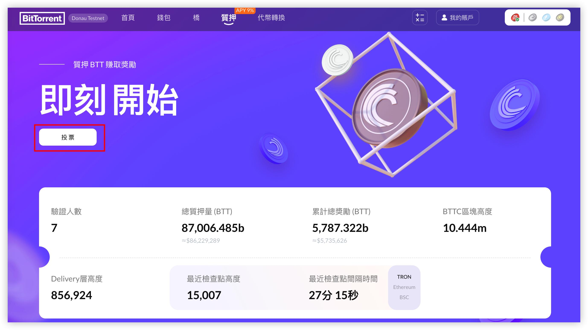
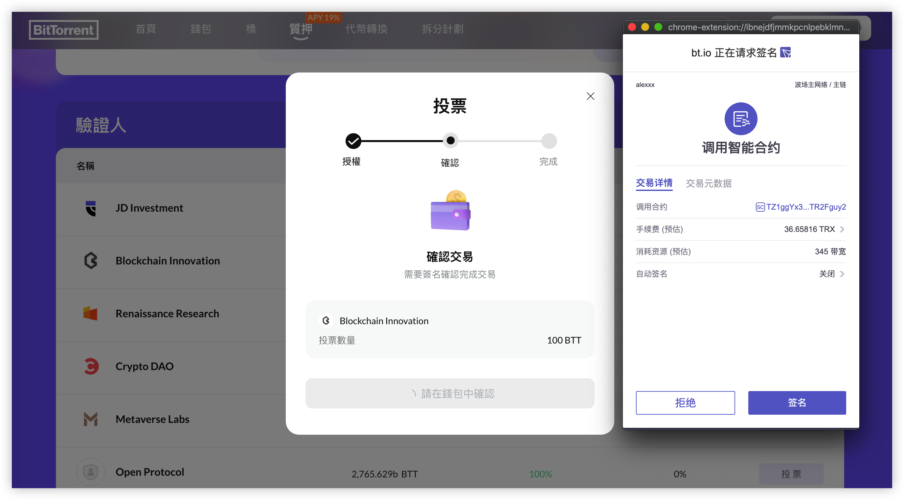
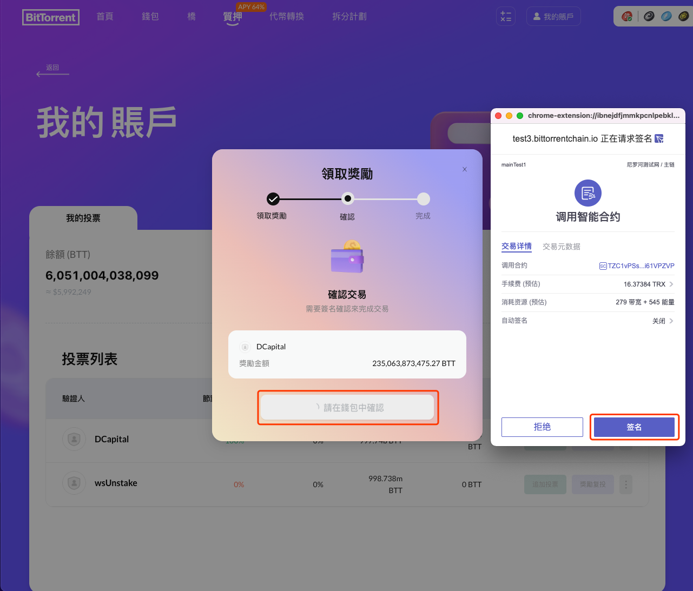
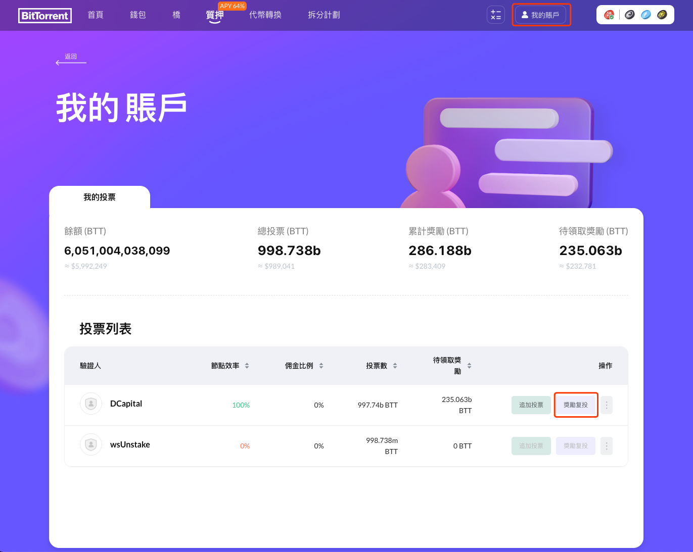
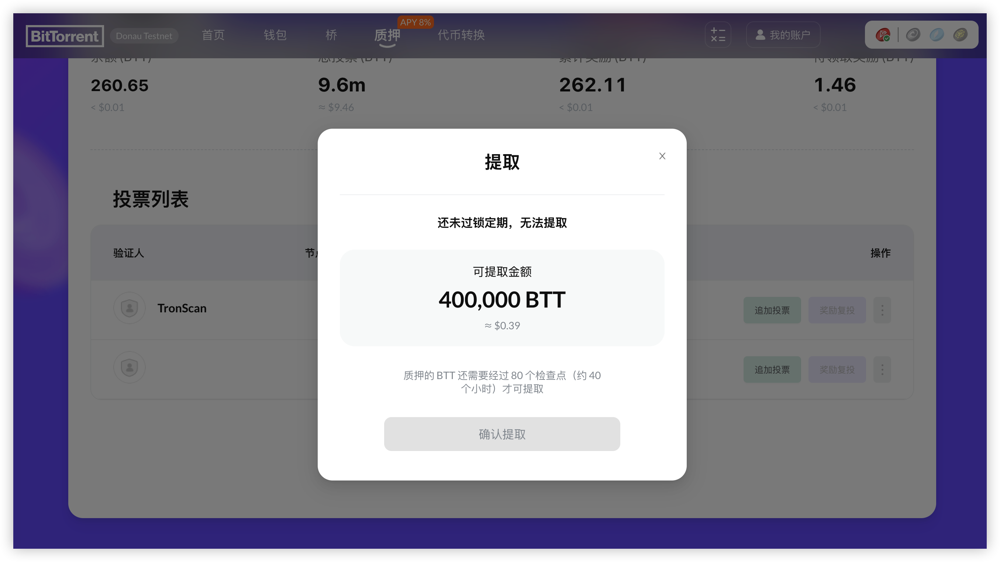

# 如何委托投票

委托人無需無需完整節點即可參與驗證。他們可以將BTT代幣投票給驗證人，並根據比例獲得獎勵。委托人在系統中起著至關重要的作用，他們可以根據自己的意願選擇驗證人。

成為BitTorrent-chain的委托人沒有先決條件，您所要做的就是擁有一個TRON帳戶。本章將介紹與質押投票相關的操作，可幫助委托人更加方便快捷的在BTTC上的進行操作。

在您的錢包（例如TronLink）中，選擇TRON主網，登錄到[BTTC Staking 頁面](https://wallet.bt.io/staking)，登錄後，您將看到帶有統計信息的驗證人列表。

* [投票給驗證人](#投票給驗證人)
* [查看自己的投票](#查看自己的投票)
* [提取獎勵](#提取獎勵)
* [獎勵覆投](#獎勵覆投)
* [轉移投票](#轉移投票)
* [提取質押的BTT](#提取質押的btt)

 
## 投票給驗證人
1. 點擊投票，選擇驗證人，點擊右側的“投票”按鈕。
 
 

2. 輸入參與投票質押的BTT數量，點擊“質押代幣”。如果是第一次使用，需要先進行授權。點擊“授權簽名”按鈕後，請在TronLink請求簽名彈框中點擊“接受”按鈕，確認授權。
 
 
 

3. 點擊“質押”按鈕後，請在TronLink請求簽名彈框中點擊“接受”按鈕，確認存款操作，提交確認後等待上鏈即可完成質押。
 

## 查看自己的投票

要查看自己的投票，請點擊[我的賬戶](https://wallet.bt.io/staking/myAccount)。
 

## 提取獎勵
1. 點擊[我的賬戶](https://wallet.bt.io/staking/myAccount)
2. 點擊投票列表右側的按鈕展開下拉列表，選擇“領取獎勵”。
 

3. 點擊“領取獎勵”按鈕後，彈出確認獎勵金額信息。
 

4. 點擊“確認”後，請在錢包中的請求簽名彈框中點擊“簽名”按鈕，確認領取獎勵，確認簽名後，等待上鏈即可完成領取獎勵。
 

## 獎勵覆投
1. 點擊[我的賬戶](https://wallet.bt.io/staking/myAccount)
2. 請在“我的賬戶”->“我的投票”頁面，選擇“獎勵覆投”。
 

3. 點擊“確認”按鈕後，請在TronLink請求簽名彈框中點擊“簽名”按鈕，確認存款操作。
 

4. 在錢包確認交易後，等待上鏈即可完成獎勵覆投操作。
 

## 轉移投票

1. 請在[我的賬戶](https://wallet.bt.io/staking/myAccount)中點擊投票列表右側的按鈕展開下拉列表，選擇“轉移投票”。
 

2. 選擇要轉移到的驗證人，點擊“投票”後進入轉移流程。
 

3. 確認驗證人信息，並輸入要轉移的BTT數量。
 

4. 點擊“確認”，需要在錢包中簽名確認交易，請在TronLink請求簽名彈框中點擊“簽名”按鈕，確認轉移操作。
 

5. 確認簽名後，等待上鏈即可完成轉移投票。
 

## 提取質押的BTT

1. 請在[我的賬戶](https://wallet.bt.io/staking/myAccount)中點擊投票列表右側的按鈕展開下拉列表，選擇“提取”。
 

2. 提取質押的BTT需要先解除質押。解除質押後，質押的BTT需要在80個檢查點（大約24個小時）之後才能提取。質押獎勵會在解除質押的同時自動發放到您的錢包地址。
 

3. 點擊“解除質押”，提交確認後，需要在錢包中簽名確認交易。
 

4. 確認簽名後，等待上鏈即可完成解除質押。
 

5. 解除質押後，需要等待 80 個檢查點（大約24個小時）才可提取。
 

6. 當經過80個檢查點後，即可提取質押的BTT。點擊“確認提取”按鈕進入確認流程。
 

7. 錢包里確認交易簽名。
 

8. 確認簽名後，等待上鏈即可完成提取。
 

