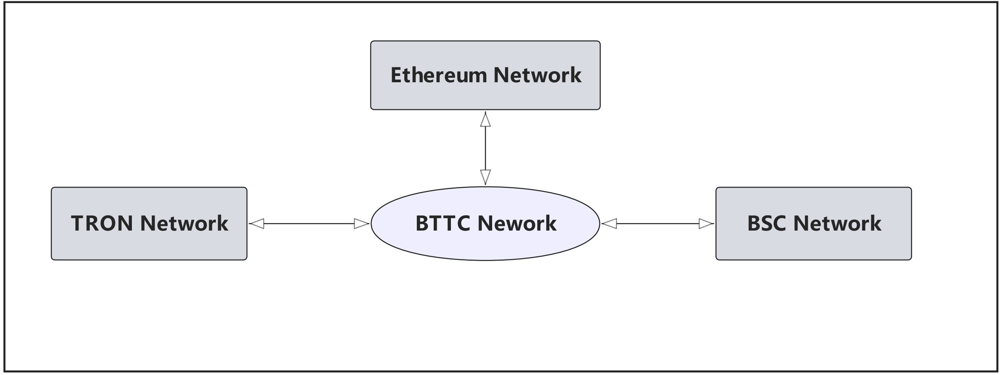
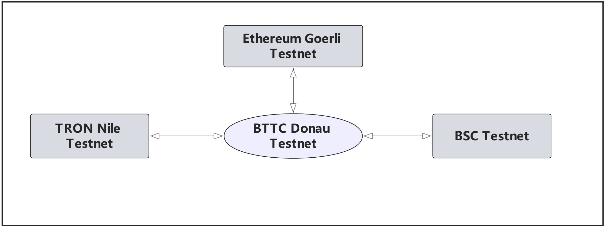

import Tabs from '@theme/Tabs';
import TabItem from '@theme/TabItem';

# 網絡詳情

<Tabs
  defaultValue="mainnet"
  values={[
    { label: 'BTTC-主網', value: 'mainnet', },
    { label: 'BTTC-測試網', value: 'donau', },
  ]
}>

<TabItem value="mainnet">

BTTC是TRON/BSC/Ethereum網絡一個二層網絡， 下面是主網的網絡結構：

## BTTC網絡

* 網絡名稱：BitTorrent Chain Mainnet
* RPC URL 1：https://rpc.bt.io
* RPC URL 2: https://bttc.trongrid.io
* 鏈ID：`199` 
* 貨幣符號：BTT
* 區塊覽器1：https://scan.bt.io
* 區塊覽器2：https://bttcscan.com

## ETH 網絡

* 網絡名稱: Ethereum 主網絡
* RPC URL: https://mainnet.infura.io/v3
* 鏈ID: `1`
* 貨幣符號: ETH
* 區塊瀏覽器: https://etherscan.io

## BSC 網絡

* 網絡名稱: Binance Smart Chain
* RPC URL: https://bsc-dataseed.binance.org/
* 鏈ID: `56`
* 貨幣符號: BNB
* 區塊瀏覽器: https://bscscan.com

## TRON 網絡
使用Tronlink Chrome插件連接到TRON網絡，登錄Tronlink錢包後需要切換主網。

* RPC URL：https://api.trongrid.io
* 區塊瀏覽器：https://tronscan.org

</TabItem>
<TabItem value="donau">

BTTC是TRON/BSC/Ethereum網絡一個二層網絡， 下面是測試網的網絡結構：

## BTTC Donau測試網
BTTC Donau測試網的接入需要使用Metamask錢包，在Metamask錢包中添加自定義RPC網絡，參數如下：
* 網絡名稱：BitTorrent Chain Donau
* RPC URL：https://pre-rpc.bt.io/ 
* ChainID：`1029`
* Symbol：BTT
* 區塊瀏覽器 1: https://testscan.bt.io
* 區塊瀏覽器 2: https://testnet.bttcscan.com
* WebSocket：wss://pre-rpc.bt.io:8546

## ETH Goerli測試網
Goerli測試網的接入需要使用Metamask錢包，在Metamask錢包中添加自定義RPC網絡，詳細操作流程可參考：[Metamask鏈接Goerli網絡](https://mudit.blog/getting-started-goerli-testnet/)，參數如下：
* 網絡名稱：Goerli - Testnet
* RPC URL：https://goerli.infura.io/v3/9aa3d95b3bc440fa88ea12eaa4456161
* 鏈ID：`5`
* 貨幣符號：ETH
* 區塊瀏覽器：https://goerli.etherscan.com

## BSC測試網
BSC測試網的接入需要使用Metamask錢包，在Metamask錢包中添加自定義RPC網絡，詳細操作流程可參考：[Metamaskl連接BSC網絡](https://academy.binance.com/en/articles/connecting-metamask-to-binance-smart-chain), 參數如下：
* 網絡名稱：Binace Smart Chain - Testnet
* RPC URL：https://data-seed-prebsc-1-s1.binance.org:8545/
* 鏈ID：`97`
* 貨幣符號：BNB
* 區塊瀏覽器：https://testnet.bscscan.com

## TRON Nile 測試網

TRON Nile測試網的接入需要使用Tronlink Chrome插件，並且Tronlink已支持Nile，用戶在登錄Tronlink錢包後需要切換至Nile測試網，通過水龍頭申請測試幣並發送至Tronlink賬號，即可完成Nile測試網環境準備。
* 官網地址：https://nileex.io
* 區塊瀏覽器：https://nile.tronscan.org

</TabItem>
</Tabs>
