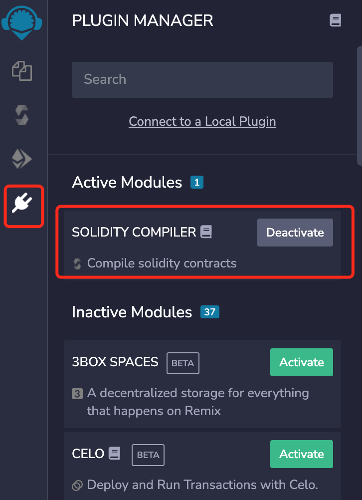
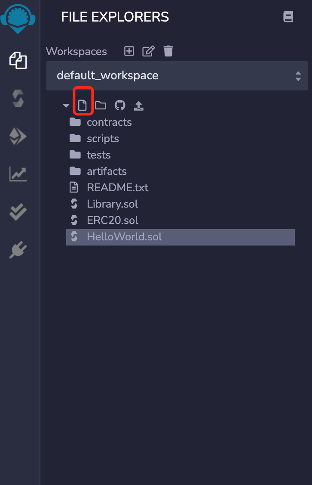
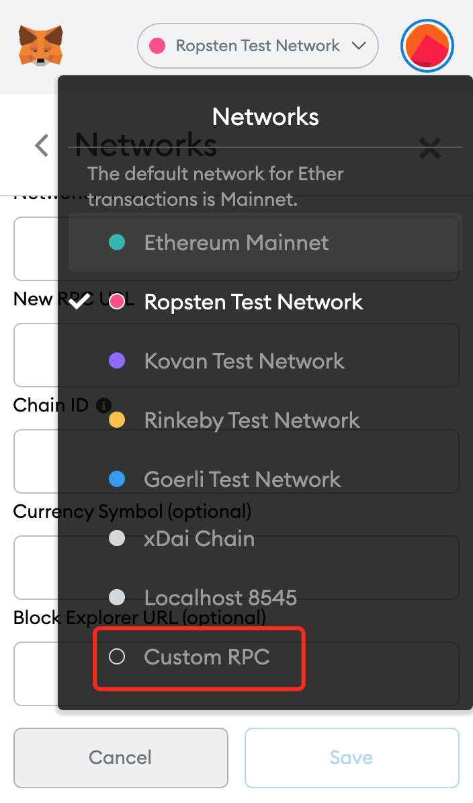
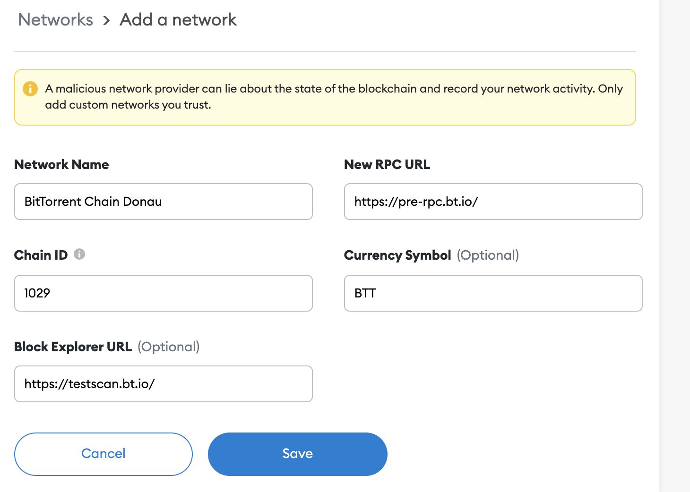
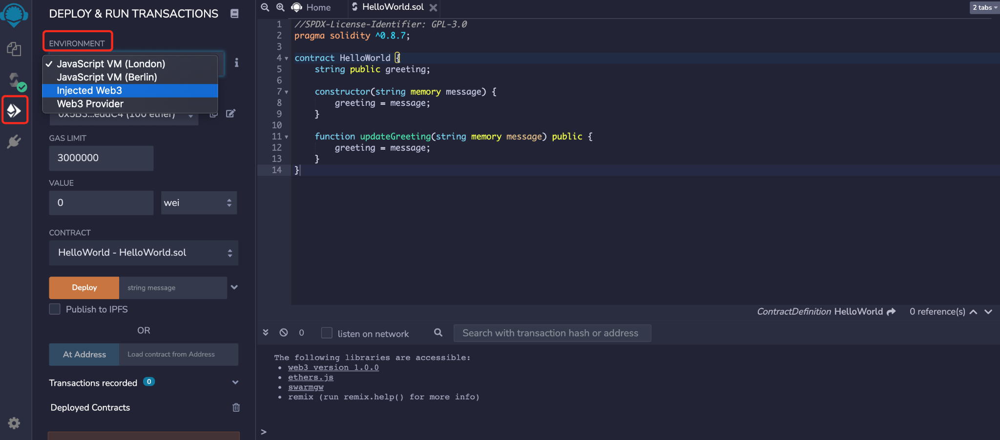
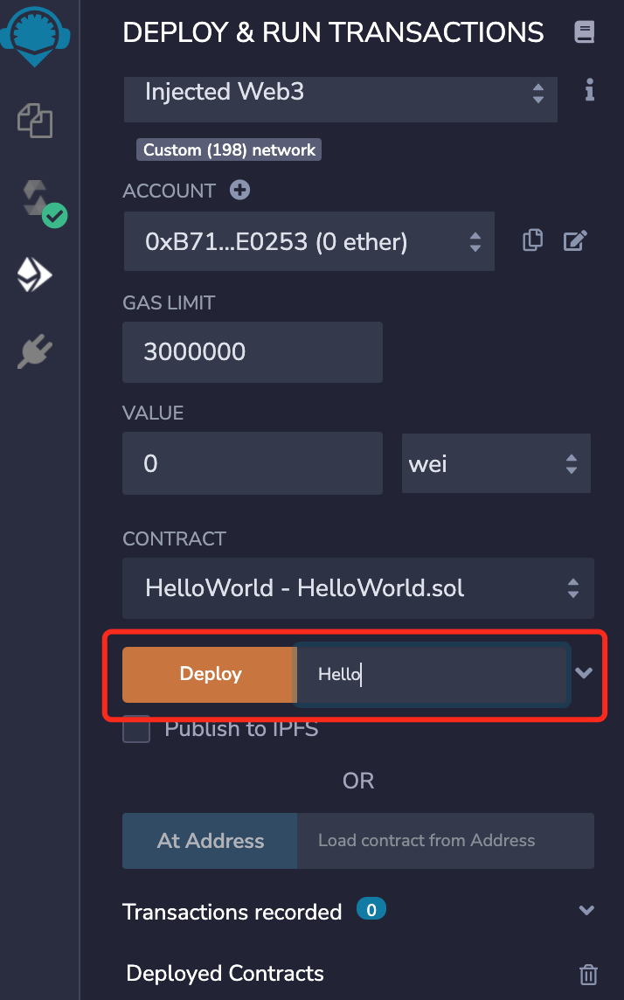
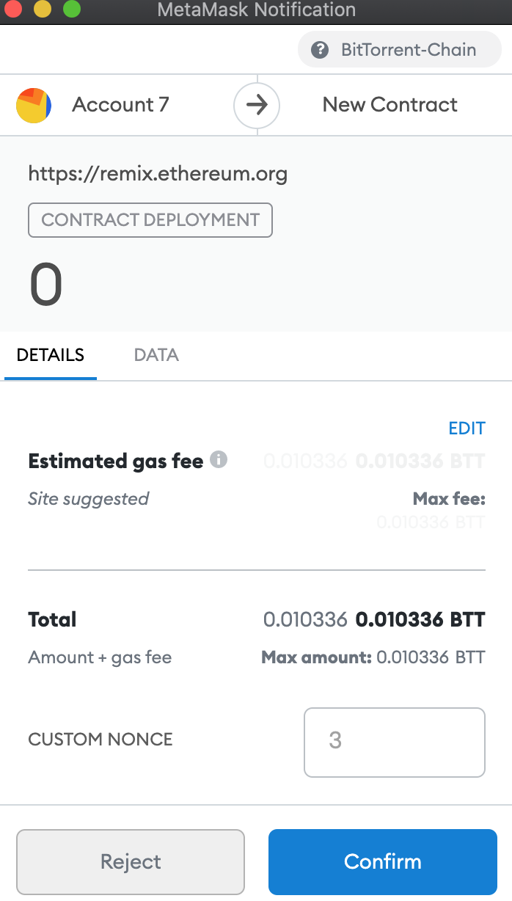

# 使用Remix在BTTC上部署合約
本文介紹如何使用Remix在BTTC測試網上部署一個簡單的HelloWorld智能合約。

## 設置Remix
Remix是一個在線的智能合約IDE，可以用與編寫、編譯以及部署合約。

如果這是您首次使用Remix，需要在插件一欄中，找到“Solidity compiler”，並激活它，如下圖



點擊圖中圈出的按鈕，創建一個新文件，命名為HelloWorld.sol，並將下面的代碼覆制粘貼到這個文件中。



## HelloWorld.sol
下面是HelloWorld智能合約的代碼：
```python 
//SPDX-License-Identifier: GPL-3.0
pragma solidity ^0.8.7;

contract HelloWorld {
    string public greeting;
    
    constructor(string memory message) {
        greeting = message;
    }
    
    function updateGreeting(string memory message) public {
        greeting = message;
    }
}
```

第一行的`//SPDX-License-Identifier: GPL-3.0`表示這個智能合約是開源的，並且使用了GPL3.0的開源協議，可以根據需求自行選擇其他開源協議。無協議時使用UNLICENSED。

第二行`pragma solidity ^0.8.7` 聲明了編譯器的版本。這個合約只能在0.8.7以及更高版本的Solidity編譯器中才能編譯成功。

`string public greeting`聲明了一個名為`greeting`的字符串類型的public變量，這種變量稱為state variable，會被永久保存在合約中以及區塊鏈上。public關鍵字讓這個變量可以從合約外部被訪問，並為其創建一個accessor函數。

`constructor`聲明了這個合約的構造函數。它可以接收一個string類型的參數message，將其存儲在內存中，並將其值賦給greeting。請注意，每個智能合約中只能有一個構造函數，它僅會在部署合約時被調用。

`function updateGreeting`聲明了一個普通函數，可以從外部調用，來修改greeting的內容。

## 編譯合約

在左側選擇Solidity編譯器，並選擇0.8.7或者更高的版本。

點擊Compile HelloWorld.sol。編譯成功時，編譯器圖標會有綠色的對勾，如圖所示。


## 網絡設置

打開MetaMask錢包，並在如圖的下拉選單中選擇Custom RPC



按照圖中的信息填寫：

* 網絡名稱（Network Name）：BitTorrent Chain Donau
* RPC URL（RPC URL）：https://pre-rpc.bt.io/ 
* 智能鏈ID（ChainID）：1029
* 符號（Symbol）：BTT
* 區塊瀏覽器URL（Block Explorer URL）：https://testscan.bt.io/



請前往水龍頭來獲取測試BTT。完成了網絡設置，接下來，就能在BTTC上部署智能合約了。

## 部署合約

首先，在Remix的DEPLOY & RUN TRANSACTIONS欄中，從Environment的下拉菜單里選擇Injected Web3



在Deploy旁邊的輸入框中，輸入初始的Greeting內容



點擊Deploy後，MetaMask會彈出交易確認的窗口



恭喜，HelloWorld合約已經成功部署到了BTTC的測試網，現在您可以與它進行交互了，同時可以再瀏覽器上檢查它的狀態。

