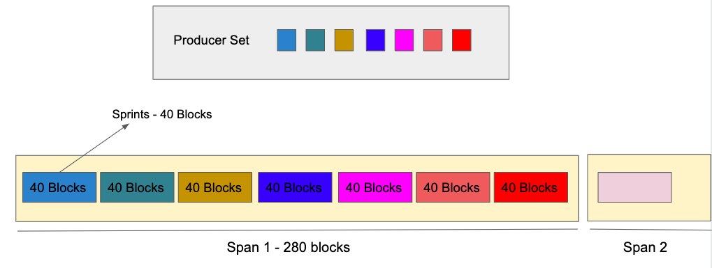

# 提議者和區塊生產者競選
Bttc層中區塊生產者是根據他們的質押占比從驗證者集合中每隔一段時間選舉
出來。驗證者的股權比例確定了被選中的概率。

## 競選流程
假設我們有3個驗證人在驗證者集合中--驗證人A、驗證人B和驗證人C
* 驗證人A質押100個BTT代幣
* 驗證人B質押40個BTT代幣
* 驗證人C質押40個BTT代幣

驗證人根據質押的大小獲得相應的槽位。

因為驗證人A有100個BTT代幣的質押，而每個槽位的成本是20個BTT代幣，所以驗證人A總共得到5個槽位，驗證人B和驗證人C總共得到2個槽位。

驗證人A、驗證人B和驗證人C得到了以下的槽位：
* [ A, A, A, A, A, B, B, C, C ]

然後，BTTC使用TRON網絡區塊哈希值作為隨機種子，對驗證人A、驗證人B和驗證人C的插槽進行隨機組合。

隨機組合的結果如下：
* [ A, B, A, A, C, B, A, A, C ]

現在，根據區塊生產者總數，BTTC使用從頭到尾的順序選擇區塊生產者--例如，對於一個有5個生產者的集合，槽位的組合是[ A, B, A, A, C]。

下一個跨度的區塊生產者集被定義為[ A：3，B：1，C：1 ]。

使用這種算法，BTTC 為 Bttc 層上的每個 `sprint` 選擇一個生產者。`sprint` 是一個驗證人連續生產的區塊數。

