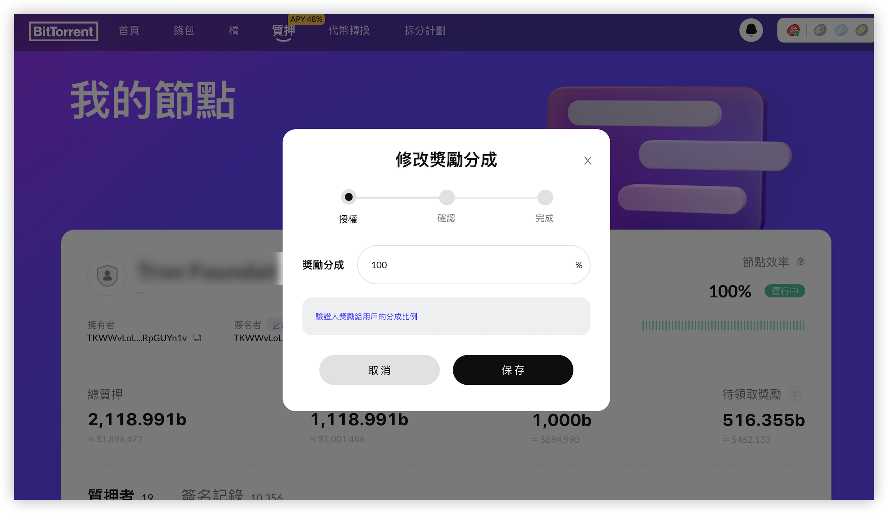

# 傭金比例

傭金比例是驗證人能從委托收益中分成的比例, 作為驗證人可以設置或者更新自己的[傭金比例](/docs/validator/glossary#傭金)。

驗證人可以根據自己的需求調整傭金比例，最低傭金比例可以設置為0%，最高傭金比例可以設置成獎勵的100%，更低的傭金比例可以吸引更多的委托人的委托投票。

作為驗證人，您應該及時通知社區有關傭金比例的變化，參考[驗證人職責](/docs/validator/responsibilities)。 

## 修改傭金比率

驗證人可以根據自己的需求調整傭金比率：

1. 使用驗證人Owner地址登錄[質押面板](https://bt.io/staking/myAccount)。
2. 在"我的賬戶"中的選擇"我的節點"頁面，點擊傭金率右側的**編輯**按鈕。

4. 輸入你的新傭金比例，點擊**保存**按鈕。

一旦您確認並簽名交易，您的傭金比例將被修改。

一旦傭金比例被更新，將有一個80個檢查點的冷卻期，在冷卻期內無法再次修改傭金比例，直至冷卻期結束。

